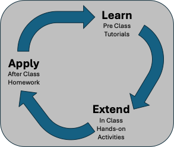

# 01 - Introduction - Class Notes

## The FarmData2 Project

- All development is in the FarmData2 Organization on GitHub.
  - https://github.com/FarmData2
- FarmData2 is the main repository for the FarmData2 application.
  - https://github.com/FarmData2/FarmData2
  - README.md:
    - Mobile-first Web Apps that support... 
      - day-to-day operations of diversified vegetable farms.
      - simplify data collection for...
        - record keeping for organic certification.
        - study of sustainable farming practices.

## FD2 School Materials

- The FD2 School materials aim to prepare you to make contributions to FarmData2.
  - They teach the main technologies involved in FarmData2... 
    - HTML / CSS
    - JavaScript
    - Vue.js
    - Cypress Testing
  - And familiarize you with 
    - architecture of the FarmData2 project.
    - the main tools used for development and testing.

## FD2 School Learning Cycle

- Each topic in the FD2 School materials follows a learning cycle that promotes the development of independent learning skills.
- This cycle has three phases:
  - Learning: Before each class students follow on-line tutorials that guide them through the construction of a small artifact. This introduces the fundamentals of the topic.
  - Extending: During each class students implement extensions to the artifact created in the tutorial. This adds experience with the topic and both broadens and deepens their knowledge of the topic. 
  - Applying: Following each class students apply what they have learned about the topic to a prototype feature within the FarmData2 project.

    

## The FarmData2 Development Environment (DevEnv)

- All work in FD2School will be done in the FarmData2 DevEnv.
  - The FarmData2 DevEnv is a cloud based linux desktop environment.
  - It is a full linux virtual machine that will run in your browser.
    - Minimizes the challenge of setup
    - Ensures everyone has the right versions of tools, extensions, libraries and languages.

- The DevEnv runs in GitHub codespaces.
  - Today's hands-on activities will guide you through setting it up.
  - But first I'll show you a little bit about it.

- Starting the DevEnv
  - __Use the Chrome browser.__
  - You'll fork the FarmData2-School upstream repository for yourself.
    - Show my fork.
  - You'll use that to make a Codespace.
    - Click the green "Code" button.
    - You'll make a new Codespace
      - It takes about 10 minutes the first time.
      - It's faster after that, so I've already created one.
        - Have one fully ready to go.
          - See: [01-Intro-Hands-On.md](./01-Intro-Hands-On.md)
      - Start the existing Codespace.
        - The screen will change a few times.
        - Eventually the "Loading" screen appears.
          - The setup takes quite a while the first time.
            - It has to build and pull Docker containers.
          - It can be 10 minutes or more... be patient...
        - After a bit the "Ready" screen will appear.
        - Click the "Open the Development Environment in a Browser Tab" link.
          - Linux desktop will appear in the browser.
        - I've already done some setup.
          - You'll do in the hands-on activities.

## The FarmData2 Application  

- FarmData2 runs in the browser.
- Launch the Firefox browser.
  - Takes a moment to open, but will be responsive once it does.
  - Visit: http://farmos
  - Login as: manager1 / farmdata2
- FarmDat2 is an add-on module for farmOS.
  - farmOS is another Open Source project.
    - It is a more general purpose application for keeping farming data.
    - FarmData2 extends it in ways that are useful for our target.
      - Small organic diversified vegetable farms.
- Three FarmData2 menus on the left.
  - FarmData2: The location of all of the FarmData2 features.
  - FD2 Examples: Examples of FD2 specific UI components - used for development and testing.
  - FD2 School: Where the work you do for FD2 School will appear.
- Demo of some FarmData2 Features
  - Click the FarmData2 menu to get the launcher screen
  - Main features
    - Seedings: Cover Crop | Direct | Tray
    - Soil: Disturbances
    - Others: Transplanting
  - Each leads to a mobile-first form
    - Click Tray
    - This form is designed for recoding planting that occur in seeding trays in a greenhouse.
      - Fill out the form
        - A few crops in the sample database used for development.
        - Locations are some of the greenhouses on the Dickinson College farm.
      - Click Submit
  - Can see the results in farmOS
    - Go to Records -> Assets -> Plants
    - Click "ID" to get newest record to the top.
      - Can see the plant listed there with its crop and location.
    - Click the "Asset Name"
      - Can see the details about the number of Trays that were planted.
    - If we want more information we can click "Logs"
      - Shows us all of the things that have been done to the plant.
    - Click the "Log Name"
      - Shows us more details about the planting event.
      - Number of trays again, size of the trays, seeds per tray cell, etc.

## Introduction to farmOS Vocabulary

- We just used the terms "Assets" and "Logs"
  - These terms have specific meaning in farmOS and thus FarmData2 as well.
    - Assets are things. For example...
      - Plants
      - Equipment
      - Animals
      - etc.
    - Logs record actions that affect Assets. For example...
      - Planting seeds in trays.
      - Transplanting from trays into a field.
      - Plowing a field.
      - Adding fertilizer.
      - Harvesting carrots.
      - etc.

## The Goal of FD2 School

- Click FarmData2 menu again
- Notice that there is no form for harvesting vegetables.
- The FD2 School activities build toward implementing this feature.
  - The homework assignments have you build a prototype harvest feature.
    - By doing so you learn the technologies, architecture and workflow.
  - Then a team project at the end aims to build the full harvest feature.

## Development Environment Copy/Paste Quirks

- In DevEnv not in Terminal
  - Copy: Ctrl-C
  - Paste: Ctrl-V
- In DevEnv Terminal
  - Copy: Shift-Ctrl-C
  - Paste: Shift-Ctrl-V
- From Host to DevEnv
  - Have to paste into the "noVNC Clipboard"
  - Easier in general to just work in the DevEnv.
    - Recommend opening the course page in the browser in the DevEnv.
  - Optional extra install can remove this limitation.

- The [FD2 Command Reference](../FD2CommandReference.md) summarizes this and more.

## Hands-on Activity

- Time now to get your FarmData2 development environment up and running.
- Follow the activity in [01-Intro-Hands-On.md](./01-Intro-Hands-On.md)

## Regroup 

- What's next...
  - After class you'll work on the Tutorial for the HTML/CSS topic.
    - [02-HTML-CSS-Tutorials.md](../02-HTML-CSS/02-HTML-CSS-Tutorials.md)
    - It guides you through building a basic website.
    - You'll build the website inside the FarmData2 Development Environment.

## Development Environment Demos

### DevEnv Timeout
- If you don't edit code for a period of time the DevEnv will "timeout".
  - Helps prevent you from running out of free time.
    - You get 60 hours/month of free use. 
    - This should be sufficient for the work on this course.
    - Can apply for [GitHub Education for Students](https://docs.github.com/en/education/about-github-education/github-education-for-students) to get 90 hours/month free.
- My DevEnv timed out while you were working.
  - To restart...
    - Click the "Restart codespace" button if your tab is still open.
    - Visit your "Codespaces" page in GitHub.
      - Its on the "Hamburger" menu in the upper left.
  - Same as you did in the hands-on activity.

### The VSCodium IDE (Open Source version of VSCode)

- Launch the VSCodium IDE
  - Takes a moment or two to launch, be patient
  - It's responsive once it launches.
  - Open the FarmData2 directory

### Demo of Workflow

- To start an assignment you will typically...
  - Open a Terminal
  - Change to FarmData2
    - Use `git status` and note `development` as the branch.
    - `development` is the "main" branch in FarmData2.
  - Create a feature branch.
  - Switch to the feature branch.
  - Make your edits.
    - Make a new `demo.md` file in the root director for demo.
    - Make some valid changes to `demo.md` for the demo.
      - Add a header, add a line of text.
    - Demo some VSCodium (VSCode) things:
      - Ctrl+S -> Save
        - Saving code changes is what keeps the DevEnv active.
        - If you do not make any changes in 15 minutes it will time out.
        - Changes will autosave after 30 seconds.
      - Alt + z or Option + z -> to toggle word wrap in VSCode.
      - Demo Shift + ctrl + I -> to auto format code
      - Demo spelling correction.

- Demo a successful commit
  - Stage the changes.
  - Commit the changes.
    - When you make a commit the FarmData2 project does some checks to keep the code base consistent and correct.
    - Checks formatting, spelling and language use.
    - Runs tests.
  - Show the commit hook output.

- Demo an unsuccessful commit...
  - Make a change with a spelling error.
  - Stage it, commit it.
  - Checks will fail and prevent the commit.
    - Look at the output to see the issue.
    - Will also be shown to you in VSCodium.
  - Fix it, stage it, commit it.

- Submitting Work
  - You will submit all of your work by making a Pull Request.
    - Push your feature branch to your for (i.e. `origin`).
    - Go to your fork on GitHub.
    - Make a Pull Request.

## References

- There are reference to help you with the Git/GitHub and DevEnv stuff.
  - [Git/GitHub Command Reference](../GitReference/GitReference.md)
  - [FarmData2 Key Commands and Shortcuts](../FD2CommandReference.md)