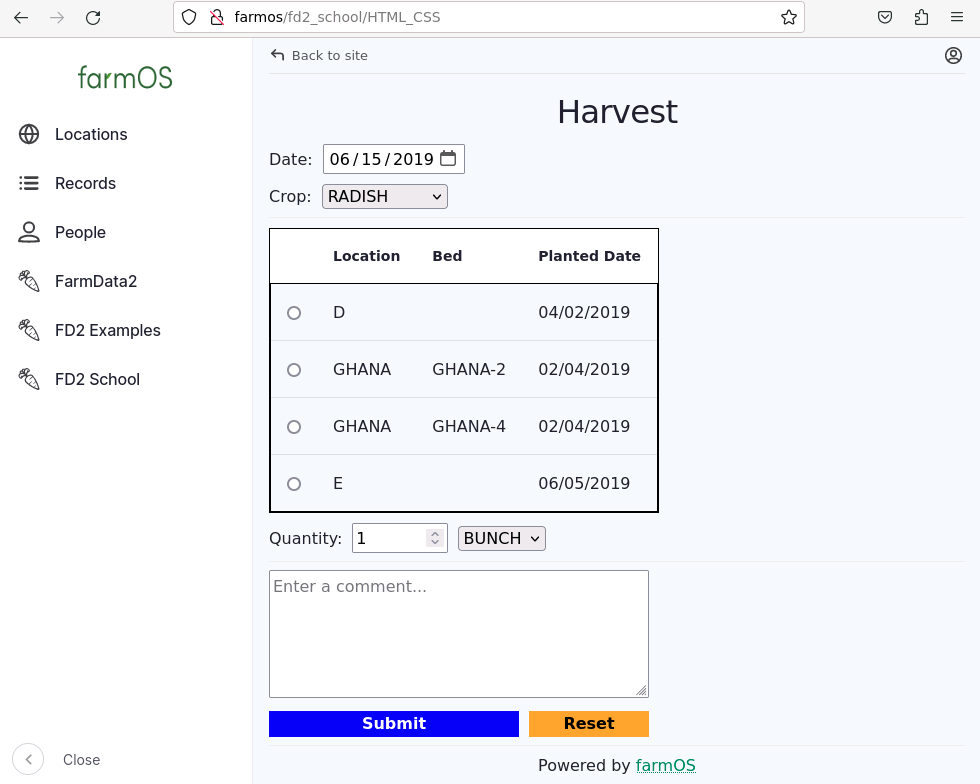

# 02 - HTML/CSS - Application

In this assignment you will build a static page using HTML and CSS that contains all of the elements necessary for a prototype of a harvest feature for FarmData2. Subsequent assignments will extend this prototype until it looks and behaves much like a full FarmData2 feature. The process of building this prototype will build your web development knowledge and skills and prepare you to contribute to FarmData2 and other open source software projects.

## Preliminaries

The following references may be helpful in completing these preliminaries:
- [Running the FarmData2 Development Environment](https://github.com/FarmData2/FarmData2/blob/development/docs/install/codespaces.md).
- [Git/GitHub Command Reference](../GitReference/GitReference.md)
- [FarmData2 Command Reference](../FD2CommandReference.md)

1. Restart your FarmData2 Development Environment.
2. Synchronize your `development` branch with the upstream to add the starter code for this assignment to your repository (See the Git/GitHub Command Reference).
3. Rebuild the `fd2_school` module (See the FarmData2 Command Reference).
4. Use the "FD2 School" menu to navigate to the "HTML-CSS" page.
   - This page should contain some placeholder text at this point.
   - If you do not see the "HTML-CSS" menu or the page with placeholder text does not appear, check that you have performed steps 2 and 3 correctly and try again.

## Building a Static Harvest Form

1. Create a new feature branch from `development` for your work on this assignment.
2. Open the FarmData2 folder in VSCodium.
3. Find the `modules/farm_fd2_school/src/entrypoints/HTML-CSS/App.vue` file and open it.
4. Remove the placeholder code from the `<template>`.
5. Add code to the `<template>` and `<style>` sections to create the page shown below. 
   - Build the page one element at a time and make a commit to your feature branch for each element. Use the commit message to describe what you have done in each commit.
   - Be sure to rebuild the `fd2_school` module each time you make changes. Alternatively you can run a "watcher" that will automatically rebuild the moduel each time you make changes. (See the FarmData2 Command Reference).
     - If new content that you add does not appear when you reload the page, hold down "SHIFT" while clicking the reload icon.
   
   
## Checklist and Tips:

- The default date should be June 15, 2019.
- The "Crop" options should be ARUGULA, ASPARAGUS, BEAN, and RADISH.
  - RADISH should be selected by default.
- The table should contain the exact content shown.
  - Note: The table inherits some styling from farmOS which is why it looks differnt than the one you created earlier.
  - Hint: Ask your favorite AI for an example of an HTML table with a group of radio buttons with no text in the left column then adapt that for this page.
- The input for the "Quantity" should be of type of `number` with a default value of 1 and minimum value of 1.
- The options next to the "Quantity" input should be BUNCH, EACH and POUND.
- The "Comment Box" should be a `<textarea>` element.
- Use CSS rules to style the page simlar to the image above. The styling does not have to be exact, but the page should look reasonably nice. At a minimum you should demonstrate that you can use both class and id selectors to style some of the elements on the page.

## Turning In Your Work

The [Git/GitHub Reference](../GitReference/GitReference.md) may be handy here if you don't remember the necessary commands.

1. Be sure all changes have been committed to your feature branch.
2. Push your feature branch to your origin repo.
3. Go to your origin repo on GitHub.
4. Make a PR to the `development` branch in the upstream repository.
5. In the body text of the PR include any comments you have on the assignment and an estimate of the amount of time that you spent on it.
6. Examine the "Files Changed" tab on your PR to ensure that you have only made changes in the `modules/farm_fd2_school/src/entrypoints/HTML-CSS` directory. Make any necessary changes, commit them to your feature branch and push it again to update the PR.

---

 All textual materials used in this repository are licensed under a [Creative Commons Attribution-NonCommercial-ShareAlike 4.0 International License](http://creativecommons.org/licenses/by-nc-sa/4.0/)

 All executable code in this repository is licensed under the [GNU General Public License Version 3 or later](https://www.gnu.org/licenses/gpl.txt)