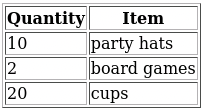
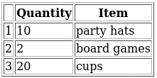

# 03 - Vue1 - In Class Hands-On Activities

## Preliminaries

1. Restart your FarmData2 Development Environment in Codespaces.
2. Synchronize the `development` branch in your clone with the upstream `development` branch.
   - After you synchronize a solution to the tutorials will have been added to `development` in the directory `modules/farm_fd2_school/03-Vue1-Tutorials-Soln`.
3. Create and switch to a new feature branch for your work on these activities.
   - Create this feature branch from the branch you created for the tutorials to continue from your prior work.
   - OR create this feature branch from `development` to work from the provided solution.

## Using the Vue Devtools

In the last video you followed you modified the contents of the `items` array using the console. In an earlier video you saw that it is also possible to view and modify data using the Vue Devtools.

1. Open the Developer tools in Firefox and find the Vue Devtools.
   - Hint: See the [FD2 Command Reference](../FD2CommandReference.md) for the keyboard shortcut to open the Developer tools, then find the "Vue" tab.
2. Use the Vue Devtools to:
   1. remove an item from the `items` array.
      - Hint: Point at the `items` array in the Vue Devtools and look at the icons that appear.
   2. add an item to the `items` array.
      - Note: you will need to use quotes around both the attribute name (e.g. "id") and the value (e.g. "3") when editing objects in the VueDevtools.

The Vue Devtools will be an invaluable debugging tool as you continue through the course.  Always keep them in mind!

## Add a `quantity` Attribute to `items`

It might be reasonable to want to operate on the quantity of an item and the description of the item separately. For example, we might want to increase or decrease the number of an item that we have on our list.

1. Change the objects in the `items` array so that they have separate attributes for the quantity of an item and the name of the item.  For example: 
   ```
   items: [
     { id: 1, quantity: 10, label: 'party hats' },
     { id: 2, quantity: 2, label: 'board games' },
     { id: 3, quantity: 20, label: 'cups' },
   ],
   ```
2. Adjust the data bindings in the `<template>` to that the items still render correctly.

## Binding `<option>`s in a `<select>`

You've seen that `v-for` can be used with lists and tables.  It can be used with any element that contains multiple other elements. 

1. Add an array named `actions` to the `data` that holds a list of actions we might take on the elements. For example:
   ```
   actions: ["Increase", "Decrease", "Delete"],
   ```
2. Create a `<select>` element on the page.
3. Use a `v-for` to create an `<option>` for each action.
   - The `<select>` should render on the page with the appropriate actions listed, but for now it will not do anything when you select an action. We'll learn how to do that soon!
   
## Render `items` in an HTML Table

Now that the quantity and description of the items have been separated, it might make more sense to render the items in a table instead of a list.

1. Change the `<template>` so that the items render in an HTML table instead of in an `<ul>`. For example:

   

   - Hint: Use the `v-for` on the `<tr>` element and the `{{ }}` in the `<td>` elements to render each `item` as its own row in the table.

## Number the `items` in the table

Let's now number the items in the list to make it easier to find an item when we are talking about them (e.g. we can say "the 4th item").

1. Add an `index` variable to the `v-for` and use it to number the items in the table. For example:

   

---

 All textual materials used in this repository are licensed under a [Creative Commons Attribution-NonCommercial-ShareAlike 4.0 International License](http://creativecommons.org/licenses/by-nc-sa/4.0/)

 All executable code in this repository is licensed under the [GNU General Public License Version 3 or later](https://www.gnu.org/licenses/gpl.txt)