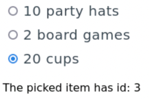

# 04 - Vue2 - In Class Hands-On Activities

## Preliminaries

1. Restart your FarmData2 Development Environment in Codespaces.
2. Synchronize the `development` branch in your clone with the upstream `development` branch.
   - After you synchronize a solution to the tutorials will have been added to `development` in the directory `modules/farm_fd2_school/04-Vue2-Tutorials-Soln`.
3. Create and switch to a new feature branch for your work on these activities.
   - Create this feature branch from the branch you created for the tutorials to continue from your prior work.
   - OR create this feature branch from `development` to work from the provided solution.

## Adding Radio Buttons to Items

Let's imagine we want a user to be able to pick an individual item in the shopping list. To do this we could add a radio button to the left of each item like is shown here:

   

1. Add the following `<input>` element to the `<li>` for the shopping list items. This will render a radio button next to each list item as shown above.
   ```
   <input 
     type="radio" 
    name="items" 
    v-bind:value="item.id"
    v-model="pickedItemId"
   />
   ```

   Note: The `v-bind:value="item.id"` gives each radio button a unique `value` based on the `id` of the shopping list item. Notice that this is the same technique that is used to assign the `key` in the `v-for`.
2. Examine the `<input>` element above and create the necessary property in the Vue `data` so that the radio button will be bound to the data. Set the initial value of this `data` property so that the first item is selected by default.
   - Hint: Remember that the `v-model` directive is used to bind inputs to Vue `data` properties.
3. Use the Vue Devtools to ensure that the radio buttons that you created are bound to new Vue `data` property that you created. 
   - Check that when you select an item using its radio button the `data` property contains the `id` of the item you selected. 
   - Check that if you change the Vue `data` property to a different value, the radio button associated with item in the list is selected.
4. Add the line of text "The picked item has id: 3" below the list of items.
   - Check that the value displayed changes to the `id` of the selected item when you click a different radio button.
   - Hint: Use a "double moustache".
   
## Clear the Radio Buttons

A user might want to clear the radio buttons so that no item is selected. But, you cannot "unclick" a radio button.  So let's add a button to clear the selected item.

1. Add a `<button>` at the bottom of the page that contains the text "Clear".
2. Add a `v-on:click` handler to the button that clears the selected radio button.
   - Hint: Set the Vue `data` property to which the radio buttons are bound to a value that is not a valid item `id`.
3. Now also change the page so that none of the radio buttons are initially selected when the page is loaded or reloaded.

---

 All textual materials used in this repository are licensed under a [Creative Commons Attribution-NonCommercial-ShareAlike 4.0 International License](http://creativecommons.org/licenses/by-nc-sa/4.0/)

 All executable code in this repository is licensed under the [GNU General Public License Version 3 or later](https://www.gnu.org/licenses/gpl.txt)