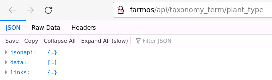
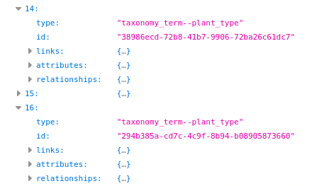

## The Tutorial

- Cover from tutorial...
  - v-bind of options to the full user object rather than id and why it makes sense.
    - avoids the search for the user's id or other information.
    - What changes needed to be made...
      - `v-bind` in the option.
      - change in the `v-if`
        - v-if="selectedUser"
          - Truthiness in JavaScript.
            - Truthy values
              - objects, arrays, non-empty strings, non-zero numbers, true
            - Falsy values
              - null, undefined, NaN, empty string, zero, false
      - change in initial value?
      - change in resets?

## New Ideas...

## Query Parameters in API Requests
- Show `posts` API
  - `https://jsonplaceholder.typicode.com/posts`
    - All posts by all users...
  - Could filter this by `userID` on the client
  - Wasted time transmitting unnecessary data.
- Introduce query parameters
  - Show the query parameter
    - General pattern with `?`
      - `https://jsonplaceholder.typicode.com/posts?userId=1`
    - Multiple query parameters with `&`
      - `https://jsonplaceholder.typicode.com/posts?userId=1&id=2`

  - You'll use in the hands on exercises.

## Watching Vue Properties

- Introduce `watch` here too to react to changes in the selected crop.
  - Show without parameters
    - Also demonstrate using `+` for string concatenation in JavaScript
  - Show optional parameter for newValue
  - Show optional parameter for oldValue

IF TIME PERMITS TRY TO SETUP THE APPLICATION A LITTLE BIT MORE.

## Exploring farmOS Data

- If time permits...

- Idea of crops vs plants again
- Idea of log_categories and specifics
  - seeding, seeding_direct, seeding_tray, seeding_cover_crop
  - transplanting
  - idea of plants in the ground vs in trays.

- Sample data
  - installed by setup.bash when you created your codes space.
  - Limited data from Dickinson farm.

- Log in as manager1
- Look at "Setup" -> "Taxonomy"
  - A Taxonomy is... collection of terms
- Taxonomies for lots of things... 
  - Let's explore "Plant type"
  - Click "List items" for  "Plant type" -> "List terms"
    - notice... Names "ARUGULA", "ASPARAGUS", "BEAN", ... "RADISH"
    - If you count there will be 28 different ones in this sample data.
  - Click "ARUGULA"
    - Notice "Crop family" - another taxonomy that creates relionships between similar types of plants.
    - Notice "Harvest unit" - "POUND"
  - Click "RADISH"
    - Notice "Crop family" - different family - "Tuber/Root Vegetables"
    - Notice "Harvest unit" - also "BUNCH"
    - Notice "Harvest unit conversions"
      - "EACH", "POUND"
        - 5 EACH = 1 BUNCH
        - 1 POUND = 1 BUNCH
      - Allows for harvesting in different units but able to convert all back to BUNCH.
  - Click a few others
    - BROCCOLI, CAULIFLOWER
  - Notice sub-types too
    - Different types of "HERB"s, "LETTUCE", "RADISH"

## farmOS API Endpoints

- Open a browser tab and log into farmos as `manager1`

- Open another browser tab
  - Looking at the "Plant type"s though an API.
    - http://farmos/api/taxonomy_term/plant_type

      

- Open `data` - notice it is an array (`[...]`)
  - notice 0-27, or 28 entries
  - Open 14 and 16
    - notice `type` `taxonomy_term--plant_type`
    - notice `id` - long string of letters and numbers
      - Unique identifier for the term.
      - 

  - open "attributes" for 14 and 16
      - notice `name` - what we care about...

  - open "relationships for "RADISH"
      - notice "fd2_harvest_unit", "fd2_unit_conversions"
      - Open data[0], type and id again...
        - `taxonomy_term--unit`
        - We'll worry about that more later...

- Can see all of the APIs offered by farmOS at:
  - http://farmos/api/
  - there you will see things like:
