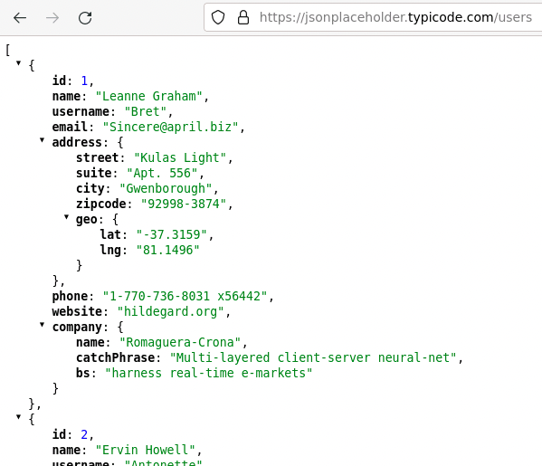
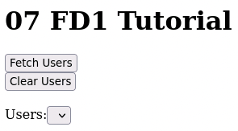
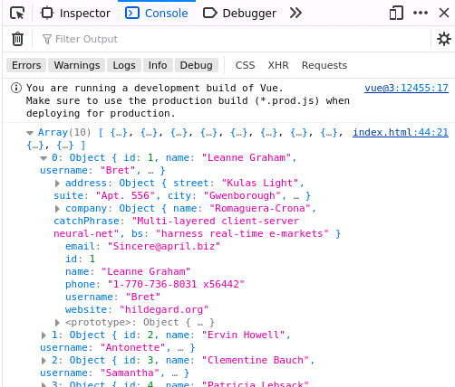

# 07 - FD1 - Tutorials

In this tutorial you will start building a (really bad) social media site. In the process you will learn about Application Programming Interfaces (APIs) and JavaScript Object Notation (JSON) that Web applications use to access the services and data they need. You'll then use an API fetch some simulated data about users of our (really bad) social media site.

## Introduction to Application Programming Interfaces (APIs)

The data and services used by Web applications (e.g. Facebook, Instagram, Google Docs, YouTube, TikTok, etc...) are provided by servers on the Internet.  These Web applications run in your browser and access the data and services that they need via Application Programming Interfaces (APIs). An API is software running on the server that provides a specific set of operations to Web applications (e.g. to retrieve a user profile, save a picture, generate driving directions, translate text to another language, or ask an AI a question). The API performs the requested action and returns a response containing the resulting information to the Web application. 

Let's learn a little more about what APIs are:

1. Watch the following video that provides an excellent conceptual introduction to APIs.
   - [APIs Explained (in 4 Minutes)](https://www.youtube.com/watch?v=bxuYDT-BWaI) from Exponent.

## An API for a Social Media Site

In the Harvest form we are creating for FarmData2 we will be using an API provided by farmOS to retrieve data about the crops and plants that exist, and to store data about a harvest operation.  But before that, this tutorial will introduce you to the use of APIs in JavaScript using the [{JSON}Placeholder API](https://jsonplaceholder.typicode.com/).

The {JSON}Placeholder API is convenient and freely available for use in testing, prototyping and learning that models the API of a basic social media site, providing services related to users, posts, comments, etc. You will be using the{JSON}Placeholder API to learn how to request and process data from an API using JavaScript in a Vue App. Then later you'll apply what you've learned to fetch some live data into the FarmData2 Harvest form.

### APIs and API Endpoints

Just like accessing a web site, an APIs is accessed via a URL. For example the URL for the {JSON}Placeholder API is `https://jsonplaceholder.typicode.com`. Also, like a web site can provide many different pages, an API can provide many different resources. The different resources provided by an API are typically called _endpoints_. Each endpoint provides a different service, or access to different kinds of data.

Let's explore the `users` endpoint that is provided by the {JSON}Placeholder API. This endpoint provides information about the users of the social media site.

1. Request data from the `users` endpoint by visiting [https://jsonplaceholder.typicode.com/users](https://jsonplaceholder.typicode.com/users) in your browser.
   - Different browsers will display the response in slightly different ways. But it should look something like this:
     
2. Have a look a the response that you received. 
   - The format should look at least a little familiar. 
   - It is an array of objects.
   - This is just like the `items` in the Shopping List app and the `cropList` in the FarmData2 Harvest Form.
   - The response from the `users` endpoint just contains a little more information.
3. For now just notice that:
   - There are 10 objects in the array.
   - Each object in the response represents one user with the properties `id`, `name`, `username`, `email`, `address`, etc.

### Understanding JSON Data

The data returned by the {JSON}Placeholder API (and most other APIs) uses the JavaScript Object Notation (JSON). We have had a little bit of experience with JSON from working with the `items` in the Shopping List and the `cropList` in the FarmData2 Harvest form.

Let's build on what we know and learn a little bit more about JSON data before jumping into building our (really bad) social media site.

1. Watch the short video [Master JSON in an easy way](https://www.youtube.com/watch?v=KMLOWkGAxVc) from Nova Designs.
  - You can stop the video at 4:30 after it finishes explaining using JSON with JavaScript and before it shows you how to do it with python.
2. Visit [https://jsonplaceholder.typicode.com/users](https://jsonplaceholder.typicode.com/users) in your browser again.
   - Now assume that the variable `user` references the object at index `0` in the response, which represents "Leann Graham".
   - How would you use JavaScript's _dot notation_ to access:
     - Leann's name?
     - Her username?
     - The zip code where she lives?
     - The longitude (`lon`) of her home? 
3. Check your answers:
     - Leann's name: `user.name`
     - Her username: `user.username`
     - The zip code where she lives: `user.address.zipcode`
     - The longitude (`lng`) of her home: `user.address.geo.lng`

## Building Our Social Media Site

Now that we understand some of the basics of using an API and accessing data in the JSON responses that we get, let's build our (really bad) social media site.

### Preliminaries

1. Restart your FarmData2 Development Environment in Codespaces.
2. Synchronize your `development` branch with the upstream `development` branch.
3. Create a new feature branch from `development` and switch to it for your work on this assignment.
4. Use the following commands to create the starter code for the tutorials:
   ```
   cd ~/FarmData2/modules/farm_fd2_school
   cp -r 07-FD1-Tutorials-Starter 07-FD1
   ```
5. Open the `FarmData2/modules/farm_fd2_school/07-FD1/index.html` file in the browser.

### Understanding the Starter Code

Let's get to know and understand the starter code first by using the page, and then by looking at the code behind it.  After we have an understanding of how it works, we'll extend it by fetching data from an API.

When you opened the `index.html` file that you created in the browser you should see a small page with two buttons and a select element as shown in the figure below.  



#### Using the Page

Complete the following tasks in the page to understand what it is doing.

1. Notice that the "Users" select is initially empty.
2. Click the "Fetch Users" button and notice that "Users" select is populated.
3. Open the "Users" select and see that it now contains two names.
4. Click the "Clear Users" button and notice that the "Users" select goes back to being empty.
5. Click the "Fetch Users" button again to repopulate the "Users" select.

#### Studying the Implementation

Now open the `FarmData2/modules/farm_fd2_school/07-FD1/index.html` file in VSCodium and answer the following questions for yourself to understand how it works.

1. What Vue `data` property is used to populate the "Users" select?
2. Why does the "Users" select appear empty on the page when it is loaded?
3. What Vue `method` is called when the "Fetch Users" button is clicked?
4. Why does the "Users" select contain two users after the "Fetch Users" button is clicked?
5. What Vue `method` is called when the "Clear Users" button is clicked?
6. Why does the "Users" select appear empty after clicking the "Clear Users" button?
7. What Vue `data` property will contain the name of the user that is selected.

### Fetching User Data from the {JSON}Placeholder API

Having two users hard-coded into the program is no way to run a social media site, even a really bad one.  So let's make use of the `users` endpoint of the {JSON}Placeholder API to populate the "Users" select with the names of all of our site's users.

### Fetching the `users`

JavaScript's provides a built in `fetch` function that is used to make requests of APIs.  We will use this `fetch` function to request the `users` data from the {JSON}Placeholder API.

1. Return to the `FarmData2/modules/farm_fd2_school/07-FD1/index.html` file in VSCodium.
2. Replace the `fetchUsers` method in Vue instance with the following:
   ```
   async fetchUsers() {
     const usersResponse = await fetch(
       'https://jsonplaceholder.typicode.com/users'
     );
     const users = await usersResponse.json();
     console.log(users);
   }
   ```
3. Save the `index.html` file and reload the page.
4. Open the Devtools and the "Console" tab.
5. Click the "Fetch Users" button.
6. The response from the `users` endpoint displayed in the console should look like the following:  
   
   - Notice that the response is an array of 10 objects, just as it was when we looked at the API response earlier.
7. Click on the little triangle next to the word "Array" to show more details about the array entries.
8. Click on the little triangle next to the `0`th index in the array to display the information about "Leanne Graham":  
   
9. Notice that the contents of the object are the same as what we saw earlier.
   - You can click on the other little triangles to see more details about the `address` (e.g. the `lng` we saw earlier) or the `company`.
   - Look at enough of the data to convince yourself that we have now used JavaScript's `fetch` function to retrieve the same information that you saw earlier.
10. Commit the changes to your feature branch with a meaningful commit message.

#### Understanding the `fetchUsers` Method

You have seen that the code you added above fetched the data from the `users` endpoint. Let's now go through that code line-by-line to understand how it works.

1. ```
   async fetchUsers() {
   ```
   - This is a Vue method, as you've created before.
   - The `async` at the beginning however is new.
     - Fetching data over the internet via an API takes time.
       - On the order of a million to a billion times longer than just assigning values to an array.
     - `async` is part of JavaScript's way of handling functions that are going to take a (relatively) long time to complete.
       - When an `async` function is called JavaScript sets it aside and does other things while the function is working or waiting.
2. ```
   const usersResponse = await fetch(
     'https://jsonplaceholder.typicode.com/users'
   );
   ```
   - `const usersResponse` declares a variable named `usersResponse`.
     - The `const` tells JavaScript that the variable is a constant. 
       - That is, that we will not change the value of the variable after it is assigned. If you are familiar with Java, `const` is similar to `final`.
   - `await fetch(...)` sends the request to the `users` endpoint of the {JSON}Placeholder API and waits for the response.
     - The `fetch` function is also an `async` function and using `await` here makes our `fetchUsers` function to stop and wait for the response before continuing.
       - It is because our function is waiting for the result from another `async` function that required us to also declared it `async`.
       - Anytime that you use `await` in a function, that function will need to also be declared `async`.
3. ```
   const users = await usersResponse.json();
   ```
   - The response from an API contains the requested data, but it also contains a lot of other information that the browser and the server use to communicate.
   - The `json()` function parses the response from the API, extracts out just the JSON information and converts it to a JavaScript object.
   - Thus, this line creates a new constant `users` and assigns it to the JavaScript object containing the array of objects that represent the users.
4. ```
   console.log(users);
   ```
   - This line prints the value of the `usersJSON` object to the console in the Devtools.
     - It is what produced the output that you saw in the console earlier.
5. Watch the following short video that provides another explanation `async` and `await` using very similar code.
- [Master Async Await Javascript in an easy way](https://www.youtube.com/watch?v=H9nFFE5_VS4) from Nova Designs.
  - You can stop at 3:50, just before the advertisement begins.

#### Accessing User Data

Let's get a little practice accessing the response data that we have received.
1. Comment out the `console.log(users)` line in the `fetchUsers` function.
2. Add the following line: `const user = users[0]`.
   - This line assigns the variable `user` to refer to the object at index 0, which represents "Leanne Graham".
3. Add statements to the `fetchUsers` function that use the information in the `user` object to print the following information to the console. Be sure to reload the page and click the "Fetch Users" button to check your work.
   - Leann's name.
   - Her username.
   - The zip code where she lives.
   - The longitude (`lng`) of her home.
4. Add a statement to the `fetchUsers` function that prints out the name of the user at index 8 in the array. Be sure to reload the page and click the "Fetch Users" button to check your work.
5. Comment out all of the `console.log` statements that you added.
6. Commit the changes to your feature branch with a meaningful commit message.
   - Note: You may need to add `zipcode` to the spelling dictionary before the commit will succeed. Point at the word "zipcode" with the blue squiggle under it and choose "Quick fix" and then "Add: "zipcode" to dictionary: fd2-cspell".

### Populating the "Users" Select

Now that we have the data about our users, let's get it to populate the "Users" select.
1. Add the following line to the end of the `fetchUsers` method.
   ```
   this.userList = users;
   ```
2. Save the file and reload the page.
3. Click "Fetch Users" and check that all of the users now appear in the list.
4. Commit the changes to your feature branch with a meaningful commit message.

### Fetching the Users Automatically with a Lifecycle Hook

A good social media site (not that this one will ever be good) won't require the user to "Fetch Users" manually.  They will appear automatically when the page loads.  Vue provides what it calls _lifecycle hooks_ that allow us to run code automatically at specific points in time as the Vue App is running.  

One of these lifecycle hooks is called `created`.  Code placed in the `created` lifecycle hook runs after the Vue instance has been created and setup. At this point all of the Vue `data` has been initialized and the `methods` are available for use. Let's use the `created` lifecycle hook to fetch the information about our users so that we don't have to click the "Fetch Users" button.

1. Add the `created()` function to the Vue instance at the same level as the `data` and `methods` as shown below.  Note that the `...` are placeholders for the code you already have in the Vue instance.  Do not remove the content of your `data` or `methods`.
   ```
   data() {
    ...
   },
   methods: {
    ...
   },
   created() {
    this.fetchUsers();
   },
   ```
2. Save the file and reload the page.
3. The "Users" select should not be populated with all of the users automatically when the page loads.
5. Commit the changes to your feature branch with a meaningful commit message.

### Cleaning up

Now that our "Users" select populates automatically we no longer need the "Fetch Users" and "Clear Users" buttons or the `clearUsers` method.
1. Remove the "Fetch Users" and "Clear Users" buttons from the `<template>`.
2. Remove the `clearUsers` method from the Vue `methods`.
3. Save the file and reload the page to ensure that it still works.
4. Commit the changes to your feature branch with a meaningful commit message.

## Checklist

- `fetchUsers` function:
  - Fetches users from {JSON}Placeholder API using `fetch(...)`.
  - Converts response to a JavaScript object using `json()` function.
  - Contains commented out practice accessing properties.
  - Assigns the retrieved data in to the `userList` Vue `data` property.
- Calls `fetchUsers` from the `created` lifecycle hook.
- Removes the "Fetch Users" and "Clear Users" buttons.
- Removes the `clearUsers` method.

## Turning In Your Work

The [Git/GitHub Reference](../GitReference/GitReference.md) may be handy here if you don't remember the necessary commands.

1. Be sure all changes have been committed to your feature branch.
2. Push your feature branch to your origin repo.
3. Go to your origin repo on GitHub.
4. Make a PR to the `development` branch in the upstream repository.
5. In the body text of the PR include any comments you have on the assignment and an estimate of the amount of time that you spent on it.
6. Examine the "Files Changed" tab on your PR to ensure that you have made only the necessary changes in your `07-FD1` directory.  Make any necessary changes, commit them to your feature branch and push it again to update the PR.

---

 All textual materials used in this repository are licensed under a [Creative Commons Attribution-NonCommercial-ShareAlike 4.0 International License](http://creativecommons.org/licenses/by-nc-sa/4.0/)

 All executable code in this repository is licensed under the [GNU General Public License Version 3 or later](https://www.gnu.org/licenses/gpl.txt)


