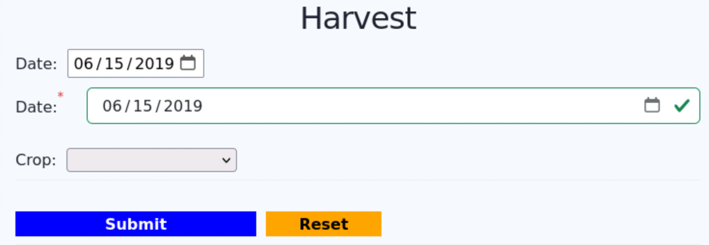

# 09 - FD3 - In Class Hands-On Activities

## Preliminaries

1. Restart your FarmData2 Development Environment in Codespaces.
2. Synchronize the `development` branch in your clone with the upstream `development` branch.
   - After you synchronize a solution to the tutorials will have been added to `development` in the directory `modules/farm_fd2_school/src/entrypoints/FD3_Activity`.
   - This is also the starter code for the in class activity.
3. Create and switch to a new feature branch for your work on these activities.
4. Open the "FarmData2" -> "FD3 Activity" page in the browser.
5. Open the `modules/farm_fd2_school/src/entrypoints/FD3_Activity/App.vue` file in VS Codium.

## FarmData2 Component Documentation

As when you worked with the `farmosUtil` library, accessing the documentation for the FarmData2 components will be helpful when you are working with them.

1. Start the documentation server.
   - See the [FD2 Command Reference](../FD2CommandReference.md) reference if you don't remember how to start the documentation server.
2. Find the documentation for the `DateSelector` component.
3. Look at the docs for the `DateSelector` and answer the following questions for yourself:
   - What props does the `DateSelector` have?
   - What are the default values of the props?
   - Do any of the props support two way binding?

## Using the FD2 `DateSelector` Component

Let's add a FarmData2 `DateSelector` component to the Harvest form. We'll leave the `DateInput` component that you created in place for for now for comparison.

1. Import the `DateSelector` component into the Harvest form `App.vue`.
2. Register the `DateSelector` component with the Vue instance.
3. Place an instance of of the `DateSelector` component in the page just after the `DateInput` component that you created in the Tutorials.
   - In the new `DateSelector`
     - use two way binding for the `date` prop.
     - bind the `required` prop to `true`.
       - Hint: If you don't know how to bind a prop to `true` in Vue, try asking your favorite AI or search engine.
     - bind the `showValidityStyling` to `true`.
4. Rebuild the `school` module and reload the page. 
5. The page should now contain two date inputs as shown below. If not, double check your work on steps 2 and 3 and try again.
   
   - Notice that by using the `DateSelector` component the date input now has styling that looks like the rest of FarmData2, including that the component spans the width of the browser.
6. Confirm that the `DateSelector` works correctly.
7. Remove all of the code from `App.vue` that used the `DateInput` component. But don't delete the `DateInput` from the `components` directory.
8. Rebuild the `school` module and reload the page.
9. Confirm that the Harvest form still works correctly by using it to create a new Harvest log and checking it in the farmOS user interface.
10. Experiment with the `required` and `showValidity` styling properties to see if you can figure out what they do.
    - Hint: Try binding them to `false` instead of `true`.

---

 All textual materials used in this repository are licensed under a [Creative Commons Attribution-NonCommercial-ShareAlike 4.0 International License](http://creativecommons.org/licenses/by-nc-sa/4.0/)

 All executable code in this repository is licensed under the [GNU General Public License Version 3 or later](https://www.gnu.org/licenses/gpl.txt)
