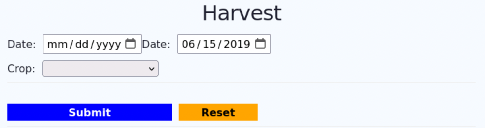
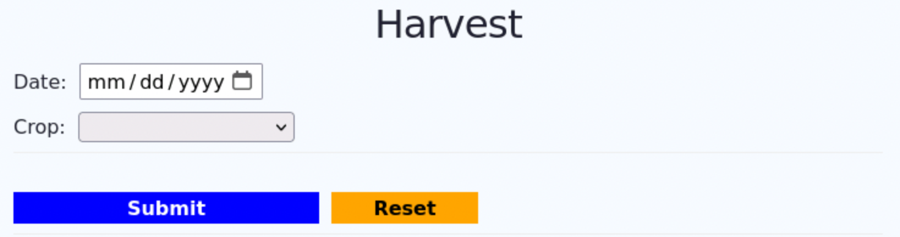

# 09 - FD3 - Tutorials

In this tutorial you will get an overview of what Vue components are and why they are useful. You will then create a basic Date input component and integrate it into the Harvest form. With a basic understanding of Vue components and their use, you will be introduced to the set of custom Vue components that already exist in FarmData2. Finally, you will replace the basic Date input component that you created with the more full featured one that is used in the other FarmData2 forms.

## Vue Components

We will use some parts of Susan B's "Vue.js Simplified" course to give you an overview of what Vue Components are and how they work.

1. Visit the YouTube page for the "[Vue.js Simplified](https://www.youtube.com/playlist?list=PLKPbe83DUccF3aCuuE0QJjemYMzTZ6l5n)".
2. Watch the first 45 seconds or so of video #1 "Introduction" (0:45).
   - This bit of video introduces the "FlashWord" application that Susan B. uses in her tutorial and will be the application that she uses to demonstrate how Vue Components work.  So having some familiarity with "FlashWord" before watching the content on Vue components will help.
3. Watch video #13 on "Single File Components" (19:19).
   - In this video Susan shows how to refactor "FlashWord" using Vue Components.  Given what we know you should be able to follow this video directly.
     - However, if you would find it helpful to see more detail on how "FlashWord" was built before Susan refactors using Vue Components you can watch Video #10 on "Building FlashWords" (22:14).
4. Be sure tha you can answer the following conceptual questions about Vue Components for yourself:
   - What is a Vue component and why is it useful?
   - What three things must you do to add an existing Vue component to your main app (i.e. from `App.vue`)?
   - What Vue mechanism is used to pass information from your main app into a Vue Component?
   - What Vue mechanism is used for a Vue Component to return value to your main app?

## Preliminaries

Like the previous tutorial this tutorial will be done using the Harvest Form that you have been building in the Application assignments.

1. Restart your FarmData2 Development Environment in Codespaces.
2. Synchronize your `development` branch with the upstream `development` branch.
3. Rebuild the `school` module.
4. Open farmOS in the browser.
5. Go to the "FD2 School" -> "FD2-Tutorial" page.
   - The "FD2 School" menu should now contain options for "FD3-Tutorial", "FD3-Activity" and "FD3-Application".
6. Open the "FD3-Tutorial" page and verify that everything works as expected.

## Building the Date Input Component

A date input is used on every form in FarmData2. For consistency across the application all of these inputs should appear and behave identically. Creating a component for the date input and using it on all of the forms will ensure that this is the case.  It also has the added benefits of
- reducing code that needs to be duplicated across all of the pages.
- reducing duplicate tests because the component can be tested just once, rather than in each page.

In the next several sub-sections you'll build a basic date input component to better understand how Vue Components are created and how they are incorporated into an application.

### Defining the Component

We will create a very basic (almost empty) component to start. Starting simple like this is a good idea in Vue (and more generally) as it allows you confirm that you have the structure of what you want to do working correctly before spending time on the details. So here, we will confirm that we are able to create a component and import it into our Harvest page before we try to implement the component's functionality.

As you saw in the video on "Single File Components" each Vue component is defined in its own `.vue` file.  In FarmData2, the `.vue` file for each component is stored in its own directory in the `components` directory.

1. Create a new directory named `DateInput` in the `components` directory.
   - Note: The `components` directory is at the top level of the `FarmData2` repository and is not within the `farm_fd2_school` directory.
2. Create a new file named `DateInput.vue` in the `DateInput` directory.
3. Add the following code to your new `DateInput.vue` file to define the (almost empty) component.
```
<template>
  <p>This will be our DateInput Component.</p>
</template>

<script></script>

<style scoped></style>
```
4. Create a new empty file named `empty.comp.cy.js` in the `DateInput` directory.
   - FarmData2 requires that components have tests (which we will learn about in the next unit). This file is a place holder for tests that allows us to commit our first component without writing any actual tests.

### Using the Component in the Harvest Form

Now let's add our (almost empty) component to the Harvest form to confirm that we have defined it correctly and that we are able to use it.

#### Importing the `DateInput` Component

The first step in using a custom Vue component is to import it into the `.vue` file where it will be being used.  For us, that is the `App.vue` file that contains our Harvest form.

1. Open the `FarmData2/modules/farm_fd2_school/src/entrypoints/FD3-Tutorials/App.vue` file file in VS Codium.
2. Add the following line at the top of the `<script>` section of the `App.vue` as shown below. 
   ```
   <script>
     import DateInput from '@comps/DateInput/DateInput.vue';
   ...
   </script>
   - Notice that here we have used `@comps` instead of a relative path to the component's `.vue` file rather than a relative path as they did in the video. `@comps` is a shortcut to the `components` directory that is defined in FarmData2's build system to simplify importing components.
   - You might also notice that the import for the `farmosUtil.js` library uses a similar shortcut (`@libs`).

#### Declaring the `DateInput` Component

Before an imported component can be used in the `<template>` it must be declared in the Vue instance. 

1. Declare the `DateInput` component by adding the following `components` property at the top of the Vue instance in `App.vue`.
   ```
   export default {
     components: {
       DateInput,
     },
     ...
   }
</script>
```

#### Using the Component in the `<template>`

After a component is imported and declared it can be used in the `<template>` as if it is an HTML element. 

1. Add the `DateInput` component to the `<template>` at the top of the Harvest form in `App.vue`
   ```
   <div
     id="FD3"
     data-cy="FD3"
   >
     <div id="harvest-header"><h1>Harvest</h1></div>

     <DateInput />
    
     ...
   </div>
   ```
2. Save, build the `school` module and reload the page.
3. Rebuild the `school` module and confirm that the new component is working.  When it is working your page should contain content similar to the following:

4. Commit the changes to your feature branch.
   - You may notice that the _pre-commit git hook_ that lints and runs tests also runs the `empty.comp.cy.js` file. In general this hook will run the tests for any file that has been changed. This ensures that only changes that pass all of the associated tests can be committed.  This will matter more when we start writing tests in the next unit.

### Completing the Date Input Component

Now that we know that we have our `DateInput` component working correctly lets implement its functionality.

#### Adding the Date Input Elements to the Component

The HTML elements for the date input are currently contained in the `App.vue` file. Let's move those to the component.

1. Copy the `<label>` and `<input>` elements for the date input from `App.vue` file into the `<template>` for our `DateInput` component in `DateInput.vue`.
   - Hint: The `<label>` and `<input>` elements for the date input appear near the top of the `<template>` in the `App.vue` file.
2. Rebuild the `school` module and reload the "FD3-Tutorial" page.
3. The Harvest form should now contain two date inputs, one beside the other as shown below. 
   
   - If your Harvest form does not look like the above, check the output of your build command and the Devtool console for any error messages.  Correct them and rebuild.
4. Commit your changes to your feature branch.

#### Removing the Duplicate Date Input

Now that the date input is being rendered by our new `DateInput` component we do not need the `<label>` and `<input>` elements for the date in our `App.vue` file.

1. Remove the `<label>` and `<input>` elements from the for the date input from the `App.vue` file.
2. Rebuild the `school` module and reload the "FD3-Tutorial" page.
3. The Harvest form should now contain only a single date input as shown below. 
   
   - If your Harvest form does not look like the above, check:
     - that you removed the correct elements from `App.vue`.
     - the output of your build command and the Devtool console for any error messages.
4. Commit your changes to your feature branch.

#### Adding a _prop_ to the Component

Now notice that the date input that is rendered from our `DateInput` no longer displays the correct default date (`2019-06-15`). To set that date our `DateInput` component will need to accept an input. Vue Components accept inputs from the file that is using them via props. 

Let's define a prop in the `DateInput` component so that it can accept an initial date from the file that is using it.

1. Add the following code to the `<script>` element in the `DateInput` component to add a prop named `initDate` that we can use to set the initial value of the date input.
   ```
   <script>
   export default {
     name: 'DateInput',
     props: ['initDate'],
     data() {
       return {
         pickedDate: this.initDate,
       };
     },
   }
   </script>
   ```
   - This code does several things:
     - It assigns the `name` of the component to be `DateInput`.
     - It creates a prop named `initDate`.
     - It creates a Vue `data` property named `pickedDate`.
2. Rebuild the `school` module and reload the Harvest form.
   - Notice that the date still displays as `mm/dd/yyyy`. This is in part because the code we moved from `App.vue` doesn't quite match the code we've added to `DateInput.vue`.
3. Examine the date input element in the `<template>` and think about the following questions:
   - To which Vue `data` property is the date input bound using `v-model`?
   - Does that Vue `data` property exist in the `DateInput` component?
   - How can this problem be fixed?
4. Update the code so that the `date` input is bound to the `pickedDate` property of the Vue `data` using `v-model`.
5. Rebuild the `school` module and reload the Harvest form.
   - Notice that the date still displays as `mm/dd/yyyy`. This is now because the `App.vue` file has not passed a value for the `initDate` prop to the component.
   
#### Passing the prop to the Component

Now that our `DateInput` component has a prop (`initDate`) to accept an input, we can have the Harvest form in `App.vue` pass the desired initial value of the date to the component.

1. Modify the `App.vue` so that the value of the `date` property is bound to the `initDate` prop of the `DateInput` component as shown below.
   ```
   <DateInput v-bind:initDate="date" />
   ```
   - This binds the `date` attribute in the Vue data of the Harvest form to the `initDate` prop in the `DateInput` component.
2. Rebuild the `school` module and reload the Harvest form.
3. Confirm that the date input now displays the correct initial value (06/15/2019). If it does not, revisit the changes that you have made in the "Completing the Date Input Component" section. 
   - If you are unable to resolve the issue you can try again by discarding all of the changes that you have made since your last commit using the following command.
     ```
     git restore .
     ```
4. Commit your changes to your feature branch.

#### Emitting an Event from the Component

At this point, the `DateInput` component is receiving the initial date via the `initDate` prop and is working correctly internally. However, the Harvest form in `App.vue` does no yet have a way to know when the date has been changed. 

We can observe this using the Vue Devtools.
1. Open the Harvest form.
2. Open the Vue Devtools.
3. Click on "`<DateInput>`" fragment" in the Vue Devtools to show the state of the `DateInput` component that is within the "`<Root>`" application (i.e. the Harvest form in `App.vue`).
4. You should see that both `initDate` and `pickedDate` have the value `06/15/2019`.
5. Change the date in the user interface.
6. Refresh the Vue Devtools
7. Now you should see that `pickedDate` has changed to the new date that you picked, but `initDate` has not changed.
8. Click on `<Root>` to see the state of the Harvest form from `App.vue`.
9. You should see that the `date` property in the Vue `data` still has the value `06/15/2019` here as well.

So when the date input is changed, the value of `pickedDate` is changing internally in the `DateInput` but that new value is not yet being communicated out to the Harvest form.  Let's fix that by having the `DateInput` _emit an event_ when the `pickedDate` changes.

1. Add the `emits` line shown below the the Vue instance in the `DateInput` component.
   ```
   export default {
     name: 'DateInput',
     props: ['initDate'],
     emits: ['date-changed'],
     ...
   ```
   - The `emits` property is an array of strings that lists the names of the events that the component might emit. So here we are saying that the `DateInput` component might emit an event named `date-changed`.
2. Now add following `watch` to the Vue instance in the `DateInput` component.
   ```
   export default {
     ...
     watch: {
       pickedDate() {
         this.$emit('date-changed', this.pickedDate);
       }
     },
     ... 
   }
   ```
   - Recall that a `watch` is run any time the property being watched changes.  So the code in the `pickedDate` watch will run anytime the value of the `pickedDate` property changes. For example, when the user picks a new date in the user interface.
   - The `this$emit` function causes the event to be emitted. It has two parameters:
     - the name of the event (e.g. `date-changed`).
       - We can choose any name for this event.
     - the _payload_ for the event (e.g. `this.pickedDate`)
       - The payload is passed to the event handler.
   - So, now any time `pickedDate` is changed, the `DateInput` component will emit a `date-changed` event and the newly picked date will be passed to the event handler.

#### Handing an Event from the Component

Now that the `DateInput` emits the `date-changed` event we need to update the Harvest form so that it handles that event and updates the value of the `date` property in its Vue `data` to the new date.

1. Add the `v-on` statement to the `DateInput` element in the `<template>` in the harvest form as shown below.
   ```
   <DateInput
     v-bind:initDate="date"
     v-on:date-changed="date = $event"
   />
   ```
   - The `v-on:date-changed` statement indicates what should happen when the `DateInput` emits a `date-changed` event.  This is the same way in which we have handled `click` events on buttons.
   - `$event` is a special variable in Vue that holds the payload that was emitted with the event. So because the `DateInput` emitted the new date as the payload, `$event` will hold the new date.
   - So, the statement `date = $event` copies the value of the new date from the `DateInput` into the `date` property of the Vue instance.
2. Rebuild the `school` module and reload the Harvest form.
3. Open the Vue Devtools and click on `<Root>` to see the Vue data in the Harvest form.
4. Change the date in the user interface.
5. Now the `date` property in the Vue `data` should change to match the newly selected date.
   - Note: You may need to refresh the Vue Devtools to see the change.
6. Click on `<DateInput> fragment` in the VueDev tools to show the Vue data in the component.
7. Change the date in the user interface.
8. Now the `pickedDate` property in the Vue `data` and the `initDate` prop will both change to match the newly selected date.
   - `pickedDate` changed because of the `v-model` in the `DateInput` component.
   - `initDate` changed because:
     - The `DateInput` component emitted a `date-changed` event.
     - The Harvest from handled that `date-changed` event by updating the `date` property in its Vue `data` to the new date.
     - Then because the `date` property is bound to the `initDate` prop, the updated `date` is passed back into the `DateInput`. 
9. Commit your changes to your feature branch.

### Additional Thoughts

Now, all of that may seem like a lot of work, particularly given that we had the date input working perfectly fine before we started this tutorial. However, there are a lot of advantages to using a component for the date input.

1. What advantages can you think of before looking at #2? 
2. Some advantages are:
   - While it may create more work for you as an individual at this point, it will save the project time in the long run because the code for the date input will not have to be re-written and re-tested on every page.
   - Because every form in FarmData will have a date input, using a component ensures that they all look and behave the same. 
   - If ever a change needs to be made to the way the date input looks or behaves, that change will only need to be made or tested in one place.

## Checklist

- The `DateInput` component is defined in `components/DateInput/DateInput.vue`.
  - In the `<template>`:
    - creates the label and date input.
    - date input is bound using `v-model` to the `pickedDate` property in the Vue `data`.
  - In the `<script>`:
    - the `name` is `DateInput`.
    - `initDate` prop is declared in `props`.
    - `date-change` event is declared in `emits`.
    - `pickedDate` property is initialized to `initDate`.
    - `watch` on `pickedDate` emits `date-changed` event.
      - `date-changed` event has the new date as its payload.
- The `App.vue` for the Harvest form:
  - imports the `DateInput` component.
  - declares the `DateInput` component in `components`.
  - does not directly contain the date input HTML element.
  - includes a `DateInput` element with:
    - `date` property `v-bound` to the `initDate` prop.
    - `v-on:date-changed` handler updates `date` property.

## Turning In Your Work

1. Be sure all changes have been committed to your feature branch.
2. Push your feature branch to your origin repo.
3. Go to your origin repo on GitHub.
4. Make a PR to the `development` branch in the upstream repository.
5. In the body text of the PR include any comments you have on the assignment and an estimate of the amount of time that you spent on it.
6. Examine the "Files Changed" tab on your PR to ensure that you have made only the necessary changes in the `components` directory and in your `FD3-Tutorial/App.vue` file.  Remove any unnecessary changes, commit them to your feature branch and push it again to update the PR.

---

 All textual materials used in this repository are licensed under a [Creative Commons Attribution-NonCommercial-ShareAlike 4.0 International License](http://creativecommons.org/licenses/by-nc-sa/4.0/)

 All executable code in this repository is licensed under the [GNU General Public License Version 3 or later](https://www.gnu.org/licenses/gpl.txt)
