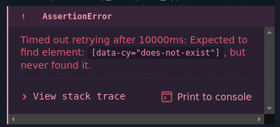

# 10 - FD4 - Application

In this assignment you will write some E2E tests for the Harvest form that you have been developing through the earlier activities.

## Preliminaries

1. Restart your FarmData2 Development Environment.
2. Synchronize your `development` branch with the upstream to add the starter code for this assignment to your repository.
3. Rebuild the `school` module.
4. Use the "FD2 School" menu to navigate to the "FD3-Application" page.
   - This page will contain a working solution to the FD2 Activity assignment, which is also the starter code for this assignment.
5. Create a new feature branch from `development` and switch to it for your work on this assignment.
6. Open the FarmData2 folder in VSCodium.
7. Find the `App.vue` and `harvest.e2e.cy.js` files in the `modules/farm_fd2_school/src/entrypoints/FD4_Application` directory and open them in VSCodium.
   - You will modify the code in the `App.vue` and `harvest.e2e.cy.js` files to complete this assignment.
7. Start the documentation server as referencing the documentation for the components will be helpful in creating tests.

## The Starter Code

The `harvest.e2e.cy.js` contains some starter code for the tests that you will create in this Application assignment. This section briefly describes the contents of that starter code as it contains some elements that did not appear in the Tutorial or Hands-On assignments.

#### The `beforeEach` and `afterEach` functions

As the names of these functions suggest, the `beforeEach` function is run before each `it` and and the `afterEach` function is run after each `it`. These functions provide a way to factor out repeated code that would need to appear at the start and end of each `it`.

#### The `beforeEach` and `afterEach` Function

The `beforeEach` function runs before each `it` is executed and performs the following operations:
- restores the _local storage_ and the _session storage_.
  - Note: The local and session storage are storage spaces in the browser that the `farmosUtil` library uses to cache API request results. Cypress clears this storage between each `it`. To preserve it between `it`s we save it after each `it` (in `afterEach` below) and restore it before each `it`. This significantly reduces the time necessary for tests to run.
- logs into farmOS as the `manager1` user.
- visits the "FD4 Application" page that you will be testing.

The `afterEach` function runs after each `it` has executed and saves the local and session storage, so that it can be restored before the next `it` is executed.

#### The "Placeholder test"

The "Place holder" test attempts to `get` an element that does not exist and is intended to fail as it is written.  You will remove it and replace it with correct tests soon.

### Running the Tests

The process for Running tests on a FarmData2 entry point is slightly different than for a simple `html` file as you did in the Tutorials and Hands-On assignments. 

The `test.bash` script is used to run the tests contained in a FarmData2 entry point (e.g. our Harvest form).

1. Run the following command:
```
test.bash --e2e --school --live --glob="**/FD4_Application/*.e2e.cy.js" --gui
```
2. Click the "Start E2E Testing in Electron".
3. Click the `harvest.e2e.cy.js` Spec.
4. Notice that after a few moments the test will fail with the following message:
   
5. You will also notice a lot of lines with `xhr GET 200`.
   - These are requests that are being made to the farmOS API by  the `farmosUtil.js` library.
   - Most of these requests are "behind the scenes" things that we don't need to worry about.
   - If you look at the final `xhr GET 200` though, you may recognize the endpoint `api/taxonomy_term/plant_type` as the API request that fetches the list of crops for the "Crop" select.

## Test the Initial State of the Harvest Form

Create a test that checks that the initial state of the Harvest form is as it should be when the page is loaded.

1. Change the description of the "Placeholder test" to be informative about the purpose of this test.
2. Modify the body of the `it` so that it checks the initial state of the Harvest form.
   - Hints:
     - Add `data-cy` attribute to the components/elements that you want to `get` in your test.
     - Use `cy.get` with the `data-cy` to get the component.
     - Use the FarmData2 documentation to find the `data-cy` attributes for the elements within the component.
     - Use `.find` to get desired elements within the component.
3. Review your test to ensure that it adequately tests the initial state of the form.
   - Your test should ensure that:
     - The "Harvest" header is visible and has the correct text.
     - The "Date" selector is visible and has the correct initial value.
     - The "Crop" selector is visible and has an initial value of `null`.
     - The "Submit/Reset" buttons are visible.
     - The "Submit" button is disabled.
     - The following elements do not exist:
       - The table of plants.
       - The "Quantity" input.
       - The "Units" select.
       - The "Comment" box.
4. Commit the changes to your feature branch.

## Test Crop Selection with Harvestable Plants

Create a test that verifies that the behavior of the Harvest form is correct when the user selects a crop that has plants available for harvest.

1. Add a new `it` with a brief but informative description to the `harvest.e2e.cy.js` file for your test.
2. Add actions and assertions to the body of the new `it`.
  - Tip: A complete test will check not just the existence/visibility of elements but also their initial values. 
3. Review your test to ensure that it adequately tests the initial state of the form.
4. Commit the changes to your feature branch.

### Test Crop Selection w/o Harvestable Plants

The test just above checked that the Harvest form works correctly if the user selects a crop for which there are harvestable plants.  However, if there are not harvestable plants for the selected crop, the Harvest form behaves differently.

Implement a test that checks that the full Harvest form displays properly when a crop that does not have harvestable plants is selected.

1. Add a new `it` with a brief but informative description to the `harvest.e2e.cy.js` file for your test.
2. Add action and assertions to the body of the new `it`.
3. Review your test to ensure that it adequately tests the behavior
4. Commit the changes to your feature branch.

## Checklist

- Tests use `get` and `find` appropriately.
- Test for the Initial State of the Harvest form:
  - Checks visibility and values for:
    - Header, "Date", "Crop", "Submit/Reset" buttons.
  - Checks "Submit" button is disabled.
  - Checks non-existence of:
    - "Plant" table, "Quantity", "Units", "Comment".
- Test for Selecting a Crop with Harvestable Plants:
  - Selects a crop with harvestable plants.
  - Checks visibility and values for:
    - "Plant" table, "Quantity", "Units", "Comment".
- Test for Selecting a Crop without Harvestable Plants:
  - Selects a crop without harvestable plants.
  - Checks visibility and content of "no plants" message.
  - Checks non-existence of:
    - "Plant" table, "Quantity", "Units", "Comment".

## Turning In Your Work

1. Be sure all changes have been committed to your feature branch.
2. Push your feature branch to your origin repo.
3. Go to your origin repo on GitHub.
4. Make a PR to the `development` branch in the upstream repository.
5. In the body text of the PR include any comments you have on the assignment and an estimate of the amount of time that you spent on it.
6. Examine the "Files Changed" tab on your PR to ensure that you have only made changes in the `modules/farm_fd2_school/src/entrypoints/FD4-Application` directory. Make any necessary changes, commit them to your feature branch and push it again to update the PR.

---

 All textual materials used in this repository are licensed under a [Creative Commons Attribution-NonCommercial-ShareAlike 4.0 International License](http://creativecommons.org/licenses/by-nc-sa/4.0/)

 All executable code in this repository is licensed under the [GNU General Public License Version 3 or later](https://www.gnu.org/licenses/gpl.txt)