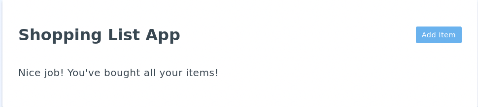
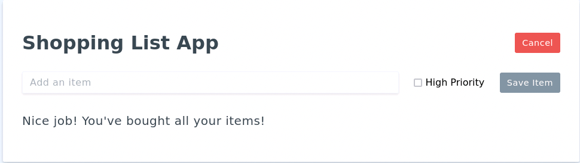
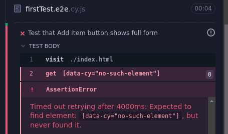
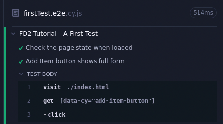

# 10 - FD4 - Tutorials

In this topic you will learn how to perform automated _End-to-End (E2E) Testing_ of a web application using the _Cypress_. The goal of E2E testing is to write scripts that simulate typical user actions within the application and to make assertions that check that the application responds correctly to those actions. Cypress is a testing framework that simplifies the process of simulating user actions and making assertions about the state of an application.

As an example, consider the "Shopping List App" that we created in earlier tutorials. 



One common user action would be to click on the "Add Item" button. One assertion we might want to make when that happens is to check that the form for adding a new item has appeared.



It is easy to see that this is the case when manually testing the application. But repeating that test (and lots of others) every time a change is made to the application becomes tedious and error prone. Thus automating E2E tests, such as the one described, make it faster, easier and much more likely to ensure that the application is thoroughly tested any time changes are made.

## An Introduction to Cypress

1. Watch the [Automated Testing with Cypress](https://www.youtube.com/watch?v=GsdldNMYHYE) (5:51) video by Jon Oliver from Sparkbox.
  - You do not have to do anything just watch the video to get an initial feel for what Cypress is and how it works.
  - You'll work with and create some Cypress tests in the remainder of this tutorial.

## Preliminaries

1. Restart your FarmData2 Development Environment in Codespaces.
2. Synchronize your `development` branch with the upstream `development` branch.
3. Create a new feature branch from `development` and switch to it for your work on this assignment.
4. In the browser, open the `index.html` file in the `FarmData2/modules/farm_fd2_school/10-FD4-Tutorials-Starter` directory.
   - This `index.html` file contains the shopping list app as it should be at the start of the tutorials for today.
   - All of your work for this assignment should be with the `10-FD4-Tutorials-Starter` directory.
5. Experiment with the "Shopping List App" a bit to refresh your memory on how it works.

## A First Test

In this section we will look at the structure of a basic Cypress test file and learn about the Cypress Test runner. 

1. Open the `firstTest.e2e.cy.js` file in VSCodium. 

### Understanding our First Test

The `firstTest.e2e.cy.js` file contains the following code:
```js
describe('FD2-Tutorial - A First Test', () => {
  it('Check the page state when loaded', () => {
    cy.visit('./index.html');
    cy.get('h1');
  });
});
```

#### The `describe` Function

Cypress test files typically contain a call to the `describe` function, which defines what happens when the test is run.

- The `describe` function accepts two parameters:
  - A string that describes the set of tests.
    - E.g. `FD2-Tutorial - A First Test` 
  - A function `() => {...}` that is called when the test is run.
    - The commands in the body of the function that is passed to `describe` defines what happens when the test file is run.
      - Note: The `() => {...}` notation defines an [_Arrow Function_](https://developer.mozilla.org/en-US/docs/Web/JavaScript/Reference/Functions/Arrow_functions) in JavaScript.
        - An arrow function is essentially a shorthand for defining a function with no name that is used only once at a specific location in the code.
        - Arrow functions are often used when a function is being passed as a parameter to another function, as is the case here in the call to `describe`.

#### The `it` Function 

When the test file is run in Cypress the body of the arrow function passed to `describe` is executed. At a minimum, this function will contain a series of calls to the `it` function, each of which defines a specific test that is to be run.

- The `it` function accepts two parameters:
  - A string that describes the specific test.
    - E.g. `Check the page state when loaded`
  - A function that defines what the test does.
    - The body of this function contains the commands that are executed when the test is run.
    - This function is most commonly created as an arrow function.

#### Test Commands and the `cy` Object

The body of the function passed to `it` contains the test commands that carry out the test. 

The commands in a test typically use the `cy` object provided by Cypress to:
- simulate user actions.
  - E.g. `visit`, `click`, `type`, `select`, etc. 
- make assertions about the elements on the page
  - E.g. `exists`,  `contains`, `has.text`, `has.value`, etc. 

The commands in our first test are:
- `cy.visit('./index.html');`
  - This command tells Cypress to visit the page `index.html` located in the current directory.
    - `cy.visit` can also be used to access a web site.
      - E.g. `cy.visit('https://www.cypress.io');
- `cy.get('h1').should('have.text', 'Shopping List App');`
  - This command tells Cypress to:
    - Find (`get`) the `<h1>` element on the page.
    - Assert that the element found `should` have the text (`have.text`) `Shopping List App`.
  - This test will pass if Cypress finds the `<h1>` element and it has the text `Shopping List App`.
  - This test will fail if Cypress either:
    - does not find the `<h1>` element
    - or the `<h1>` element is found, but does not have the text `Shopping List App.`

### The Cypress Test Runner

Now that we have an understanding of our first Cypress test, let's run the test in the _Cypress Test Runner_.

1. Launch the Cypress Test Runner with the commands: 
   ```
   cd ~/FarmData2/modules/farm_fd2_school/10-FD4-Tutorials-Starter
   npx cypress open
   ```
2. Click on "E2E Testing"
3. Click the "Start E2E Testing in Electron" button.
   - A Cypress Test Runner window will open showing the tests (also called _specs_) that Cypress has found.
   - For now you will see just the `firstTest.e2e.cy.js` file listed.
4. Click on `firstTest.e2e.cy.js`
   - The Cypress Test Runner window will change to show the "Shopping List App" on the right and the results of the test run on the left.
     

#### A Passing Test

The Cypress Test Runner Window displays both the application being tested (on the right) and the results of the tests (on the left).

1. Look closely at the test results on the left and notice:
   - The text at the top is `FD2-Tutorial - A First Test`, which comes from the call to `describe`.
   - The text below that with the green checkmark is `Check the page state when loaded`, which comes from the call to the `it`.
   - Under `TEST BODY` are the results of each of the commands in the `it`.
     - visit `./index.html`
     - get `h1`
     - assert expected `<h1>` to have text `Shopping List App`.
       - Notice that the "asset" line is green, indicating that the assertion passed.
   - At the top of the window there a:
     - `1` next to the green checkmark indicating that one test has passed.
     - a `--` next to the red X indicating that no tests have failed.

#### A Failing Test

You've seen a passing test.  Now let's imagine we want to make a change in `index.html`.

1. Open `index.html`
2. Change the `header` in the Vue `data` to be `Shopping List Application`.
3. Save the changes.
4. Go back to the Cypress Test Runner.
5. Re-run the test by clicking the "Re-Run" icon at the top of the window to the right of the green checkmark and red X.
   - Watch the test results as the test runs.
   - Notice that Cypress pauses for a few seconds on the "assert" before failing the test.
   - Click the "Re-Run" icon again if you missed it the first time.
6. When the test completes you'll notice that now there are no tests passing and `1` test is failing.
7. Look at the test results on the left and observe that the Test runner clearly indicates:
   - the assertion that failed.
   - what was expected.
   - what was actually found. 

#### Fixing the Failing Test

Now assuming the change we made from "Shopping List App" to "Shopping List Application" is desireable, we need to fix the test to match the new behavior.

1. Go to `firstTest.e2e.cy.js` in VSCodium.
2. Change the line:
   ```js
   cy.get('h1').should('have.text', 'Shopping List App');
   ```
   to be
   ```js
   cy.get('h1').should('have.text', 'Shopping List Application');
   ```
3. Save the file.
4. Go back to the Cypress Test Runner.
5. Notice that Cypress automatically re-ran the test and it now passes.
6. Commit your changes to your feature branch.

## Using `data-cy` Attributes

Our first test above used `cy.get('h1')` to find the `<h1>` element in the page. In fact, any of the [CSS Selectors](https://developer.mozilla.org/en-US/docs/Learn_web_development/Core/Styling_basics/Basic_selectors) that we learned about earlier can be used with `cy.get` to select elements on the page.

Using the `h1` _element selector_ worked fine in this case because there is only one `h1` element in the page. But, if another `h1` element were added to the page or the `h1` was changed to an `h2`, then our test would fail. Thus using element and other CSS selectors leads to _brittle_ (easy to break) tests.

[Cypress best practices](https://docs.cypress.io/app/core-concepts/best-practices#Selecting-Elements) recommend adding a _`data-cy` attribute_ to every element that is used in a test. Then using that `data-cy` attribute in `cy.get` to get the element. Let's see how this works.

1. Edit `index.html` changing `<h1>` tag to be:
   ```html
   <h1 data-cy="app-heading">
   ```
2. Edit `firstTest.e2e.cy.js` changing the `cy.get` statement to be:
   ```js
   cy.get('[data-cy="app-heading"]').should(
      'have.text',
      'Shopping List Application'
    );
   ```
   - Notice that using `data-cy` attributes also make the tests more readable (`app-heading` is much more informative than `h1`).
3. Save your changes.
4. Go back to the Cypress Test Runner and rerun the test.
   - The test should still pass. If it does not revisit steps 1 and 2 and try again.
5. Commit your changes to your feature branch.

## Testing the Initial State of the Page

To fully test that the initial state of the page is correct, we'll need to check more than the page heading. We should check that all of the elements that should exist do and are correct. We should also check that all of the items that should not exists don't.

### Checking the Elements that Should Be Visible

Let's update the application and the test to check for the things that should exist on the page when it is first loaded. In addition to the heading, which we have already checked, we need to check the following:
- That the "Add Item" button.
- The text "Nice job! You've bought all your items!"

1. Add `data-cy="add-item-button"` as an attribute to the `<button ...>` tag for the "Add Item" button.
2. Add `data-cy="nice-job-message"` as an attribute to the `<p ...>` tag for the "Nice job! You've bought all your items!" message.
3. Add the following assertions to the `it` in our test.
   ```js
   cy.get('[data-cy="add-item-button"]').should('be.visible');
   cy.get('[data-cy="nice-job-message"]')
     .should('be.visible')
     .should('contain.text', 'Nice job!');
   ```
   - Notice that you can make multiple assertions about an element by using `.should` multiple times.
4. Save the changes.
5. Go back to the Cypress Test Runner.
   - Because you changed the test file, the test should have re-run automatically. 
   - Ensure that the test passed, and if it did not revisit steps 1-3 and try again.
   - Notice that test results now show three assertions being made, one for each `should`.
6. Commit your changes to your feature branch.

### Checking the Elements that Should Not Exist

Now to be very thorough we should also check that the other elements of the app that do not exist when the page is first loaded.

1. Add the following `data-cy` attributes to the indicated elements in `index.html`.
   - The "Cancel" `<button ...>`
     - `data-cy="cancel-button"`
   - The `<input ...>` for "New Item"
     - `data-cy="new-item-input"`
   - The `<input ...>` for the "High Priority" checkbox.
     - `data-cy="high-priority-checkbox"` 
   - The "Save Item" `<button ...>`
     - `data-cy="save-item-button"`
2. Add the following assertions to the `it` in our test.
   ```js
   cy.get('[data-cy="cancel-button"]').should('not.exist');
   cy.get('[data-cy="new-item-input"]').should('not.exist');
   cy.get('[data-cy="high-priority-checkbox"]').should('not.exist');
   cy.get('[data-cy="save-item-button"]').should('not.exist');
   ```
3. Save the changes.
4. Go back to the Cypress Test Runner.
   - Ensure that the test passed, and if it did not revisit steps 1-2 and try again.
5. Commit your changes to your feature branch.

## Testing the "Add Item" Button

Now that we have a test that checks that the proper elements are showing when the "Shopping List Application" appears, let's test that clicking the "Add Item" button works correctly.

It is a best practice to build tests incrementally rather than trying to write the entire test at once. 

A good process for incrementally building a test is:
1. Plan the test by walking through the steps manually noting:
   - what action(s) you need to simulate in the test.
   - what assertions you will need to make to check that the action(s) had the intended effect.
2. Add a mostly empty test that initially fails and run it.
   - Writing a test that initially fails doesn't take much effort and is a good practice for a few reasons.
     - Getting all of the `{}` and `()` to match up can be tricky. Writing a simple test makes it easier to get the structure correct.
     - Having the test fail initially, ensures that when it eventually passes that you have actually tested something.
3. Add actions and assertions one-by-one, running each one as it is added.
   - Adding actions and assertions one-by-one is also beneficial for a few reasons.
     - It also makes it easier to get all of the `{}` and `()` correct.
     - If an action or assertion does not work correctly, you know that it was most likely the one you just added. This makes it much faster and easier to debug your tests.

We'll use this incremental process to build the test for the "Add Item" button.

### Manual Walk Through

We want to test that clicking the "Add Item" button has the intended effect. So let's walk through that process manually.

1. Visit the "Shopping List Application" page in the browser (reload it if it is already visible).
2. Click the "Add Item" button.
3. Think about:
   - What 2 actions will you need to simulate in the test?
   - What 6 assertions will you need to make to check that the actions had the intended effect?

### Adding a Failing Test

Now that we know what actions we need to simulate and what assertion we will need to make, let's add a failing test to be sure we have the basic structure correct.

1. Add the `it` with the description "Add Item button shows form" to the `firstTest.e2e.cy.js` file as shown below.
```js
describe('FD2-Tutorial - A First Test', () => {
  it('Check the page state when loaded', () => {
    ...
  });

  it('Add Item button shows form', () => {
    cy.visit('./index.html');

    cy.get('[data-cy="no-such-element"]');
  });
});
```
- This new test tries to `get` an element that does not exist so it will fail initially.
2. Save the file and check that the new test fails in the Cypress Test Runner.
   - The left part of the Cypress Test Runner will indicate as shown below that our first `it` still passes (green check), but the newly added `it` fails (red X and a message explaining the failure).
   

### Adding Actions and Assertions

Now that we have a failing test, let's start adding the actions and assertions.

#### Finding the Actions and Assertions we Need

The first thing we need to do is to simulate the user clicking the "Add Item" button. But we don't yet know how to do that in Cypress. 

There are two good ways to figure out how to simulate an action or make an assertion in Cypress:
1. Refer to the documentation.
2. Ask your favorite AI how to do what you want to do.

Very specifically, we need to simulate a click on the "Add Item" button element which has the `data-cy` value `add-item-button`. 

So let's explore each of the above approaches briefly.

##### Cypress Assertion and Action Documentation

1. Visit the [Cypress Reference](../CypressReference.md).
2. Find the _Action_ that is used to click on a button.
3. What command would you write to click on the "Add Item" button?

##### Asking AI

1. Open your favorite AI or use Google (with Gemini's AI Overview).
2. Ask it "how do I click on the button with data-cy attribute add-item-button in a Cypress test"
3. Did you get the same command that you came up with using the documentation?
   - Using an AI query is often best when you know what you want to do, but the basic documentation does not provide an example.

#### Clicking the "Add Item" Button

1. Return to the "Add Item button shows form" test in `firstTest.e2e.cy.js`.
2. Remove the statement that caused the test to fail.
3. Add the following command that clicks the "Add Item" button:
```js
cy.get('[data-cy="add-item-button"]').click();
```
4. Save the file and return to the Cypress Test Runner.
   - The two tests should have run automatically when you saved, and both should have passed (green check marks).

#### Making Assertions

Now that the test has clicked the "Add Item" button, it needs to make assertions that check that the click had the intended effect.

1. Add each of the following assertions to the test one-by-one. Save the file and check the Cypress Test Runner to ensure that the test passes after each assertion is added.
   - Check that the "Cancel Button" is visible.
     ```js
     cy.get('[data-cy="cancel-button"]').should('be.visible');
     ```
   - Check that the new-item input is visible.
     ```js
     cy.get('[data-cy="new-item-input"]').should('be.visible');
     ```
   - check that the "High Priority" checkbox is visible.
     ```js
     cy.get('[data-cy="high-priority-checkbox"]').should('be.visible');
     ```
   - Check that the "Save Item" button is visible and is not enabled.
     ```js
     cy.get('[data-cy="save-item-button"]')
      .should('be.visible')
      .should('not.be.enabled');
      ```
   - Check that the "Add Item" button does not exist.
     ```js
     cy.get('[data-cy="add-item-button"]').should('not.exist');
     ```
2. Do the assertions that you added agree with the ones that you thought you would need?
3. Commit your changes to your feature branch.

## Time Travel with Cypress

The Cypress Test Runner makes it easy to go back and follow the execution of a test. In Cypress terminology, they call this _time travel_. 

1. Click on the "Add Item button shows full form" line in the left half of the Cypress Test Runner.
   - This will show the details of the passing test.
     
2. Point at the "visit" line.
   - Notice that the Shopping List Application is shown as it would have been when it was first visited.
3. Point at the `get` line.
   - Notice that the "Add Item" button is highlighted in the application, indicating that it has been found.
4. Point at the `click` line.
   - Notice that there is a red dot on the "Add Item" button and that the application alternates between "Before" and "After" views. This shows the effect of clicking on the button.
5. Point at each of the `assert` lines.
   - Notice that the element about which the assertion is being made is highlighted.

Cypress' time travel feature is useful for understanding the execution of tests. This can be very helpful in debugging tests that are failing.

## Checklist

- The following `data-cy` attributes have been added to the `<template>`
  - `app-heading`: "Shopping List Application" `<h1>` 
  - `add-item-button`: "Add Item" `<button>`
  - `nice-job-message`: "Nice Job!" `<p>`
  - `cancel button`: "Cancel" `<button>`
  - `new-item-input`: "New Item" text `<input>`
  - `high-priority-checkbox`: "High Priority" checkbox `<input>`
  - `save-item-button`: "Save Item" `<button>`
- The "Check the page state when loaded" test asserts that:
  - `app-heading` has correct text.
  - `add-item-button` is visible.
  - `nice-job-message` is visible and has correct text.
  - `cancel button` does not exist.
  - `new-item-input` does not exist.
  - `high-priority-checkbox` does not exist.
  - `save-item-button` does not exist.
- The "Add Item button shows full form" test:
  - clicks on the "Add Item" button.
  - asserts that
    - `cancel-button` is visible.
    - `new-item-input` is visible.
    - `high-priority-checkbox` is visible.
    - `save-item-button` is visible and is not enabled.
    - `add-item-button` does not exist.

## Turning In Your Work

1. Be sure all changes have been committed to your feature branch.
2. Push your feature branch to your origin repo.
3. Go to your origin repo on GitHub.
4. Make a PR to the `development` branch in the upstream repository.
5. In the body text of the PR include any comments you have on the assignment and an estimate of the amount of time that you spent on it.
6. Examine the "Files Changed" tab on your PR to ensure that you have made only the necessary changes in your `FD4-Tutorial/App.vue` file.  Remove any unnecessary changes, commit them to your feature branch and push it again to update the PR.

---

 All textual materials used in this repository are licensed under a [Creative Commons Attribution-NonCommercial-ShareAlike 4.0 International License](http://creativecommons.org/licenses/by-nc-sa/4.0/)

 All executable code in this repository is licensed under the [GNU General Public License Version 3 or later](https://www.gnu.org/licenses/gpl.txt)
