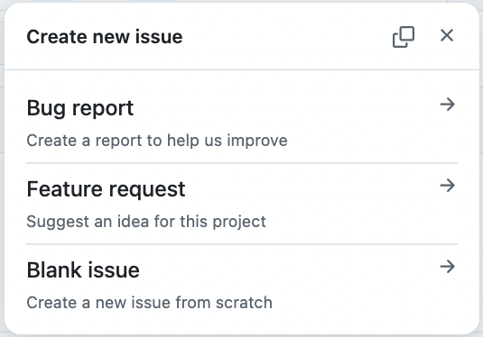

# 11 - OSS1 - Tutorials

The Tutorials, Activity and Application assignments up to this point have introduced you to Web development using HTML, CSS, Vue.js, and Cypress. You practiced with these technologies in spike projects (shopping list, social media site) and applied what you have learned to building a prototype for the FarmData2 Harvest feature.

From here we'll move into a more authentic Free and Open Source Software (FOSS) contribution workflow. You'll be reporting issues, fixing bugs, and creating new features. At first you'll continue to practice these things in the FarmData2-School repository. Then the course concludes with the goal of having you make a contribution to the live FarmData2 project.

This topic focuses on reporting issues and bug fixing.

## Free and Open Source Software Workflow

One way of understanding FOSS workflow is to consider the different roles that people take on in FOSS communities. Below are descriptions of some roles that exist. These roles are _prototypical_ and not every one of them roles will exist exactly as described in every FOSS community. Some communities will have slightly different roles, or multiple roles may be combined, etc. In addition, a given individual might simultaneously, or at different times take on multiple roles. So even though they are not exact or universal, understanding these prototypical roles can be helpful in understanding how work happens in FOSS communities.

### FOSS Community Roles

- **Users** are people who use the software to accomplish tasks. They download and install the software on their machines, or access it via the Web or a cloud based service.
- **Requestors** are typically users that discover bugs, inconveniences, and inefficiencies and report them to the community, or ask for new features that they would find useful.
- **Contributors**: are anyone who makes contributions to the project. Because requestors are contributing bug reports and feature requests they are a type of contributor. Other types of contributors write or improve documentation, perform translations, do user interface design, make code contributions that fix bugs and add features, and lots of other things.
- **Maintainers**: are typically long term contributors who have taken on specific responsibilities within the project. They may work on many of the same types of contributions as contributors but tend to focus on larger more complex tasks that require a deeper understanding of the project. Maintainers often also review contributions from others and have permissions that allow them to merge contributions from others into the upstream project repositories.
- **Leaders**: are typically maintainers who have taken responsibility for managing the project community, guiding the decision making process, making key decisions when consensus cannot be reached, and performing longer-term planning for project.

If you would like to self-check your understanding of these roles try the questions on [FOSS Community Roles](
https://author.runestone.academy/ns/books/published/gitkit2ed/topic-foss-communities.html#topic-foss-communities-4) in the GitKit text on Runestone Academy.

## Preliminaries

1. Restart your FarmData2 Development Environment in Codespaces.
2. Synchronize your `development` branch with the upstream `development` branch.
3. Rebuild the `school` module.
4. Visit the farmOS application in the browser.
5. Log into farmOS as `manager1`
6. Open the "FD2 School" -> "OSS1" page.

## Playing Roles

As you work through this Tutorial and the following Activity and Application assignments you'll take on different roles.  As a "user" you will find a bug in the application. As a "requestor" you will write up a bug report describing the bug. Finally as a "contributor" you will evaluate several different approaches to fixing the bug, fix and test the fix, and then create a pull request describing your fix.

### User: Discovering a Bug

The Harvest form as implemented in the current `development` branch contains at least one significant bug. Here is a vague description of this significant bug:

> When the Harvest form is filled out the "Submit" button becomes enabled. If a different crop is then chosen the enabled state of the submit button is inconsistent.

1. Experiment with the Harvest form until you feel like you have a good enough feel for the above bug to describe it in detail. 
   - You are playing the role of the user, so you do not need to have any idea how to fix it at this point.

### Requestor: Reporting a Bug

When a user discovers a bug they may ignore it assuming they won't encounter it again, or that it doesn't really affect their ability to complete tasks. If it does affect their ability to complete tasks, they may develop a work around that allows them to do what they need to do even though the bug exists. The user might also find there is no workaround or that the work around is too inconvenient. In such a case, the user can become a _**requestor**_ by reporting the bug to the project community in hopes of having it fixed.

Now that you have discovered a bug as a user, we'll assume you'd like to see it fixed.  So, in this section you'll play the role of a _**requestor**_ and report the bug to the community.

1. Review the following source that describes how to write an effective bug report:
   - [How to write effective bug reports](https://capgemini.github.io/testing/effective-bug-reports/) by Malcolm Young. (~11 min read).
   - [Providing Reproduction Steps](https://secure.phabricator.com/book/phabcontrib/article/reproduction_steps/) from the Phabricator Contributor Docs.
2. Go to the upstream FarmData2-School repository that you are using on GitHub (the one that you forked your copy from.)
3. Open the "Issues" tab at the top of the page.
4. Click the "New Issue" button.
5. FarmData2 provides several different templates for creating different types of issue: 
   
6. Choose the "Bug report" template.
7. Use the advice from the above sources and the descriptions below to complete each of the following parts of the template to report the bug that you were guided to find earlier.
   - **Title**: The title should be brief while also clearly indicating where the bug is occurring and what it is.
   - **Description:** Expand on the title to describe the bug, when and where it occurs and why it is a bug. Do not duplicate information here that appears in later sections.
   - **Steps to Reproduce**: Give numbered list of short, precise, step-by-step instructions that someone reasonably familiar with FarmData2 could follow to reproduce the bug. 
     - **NOTE** The steps given earlier are not sufficient for this purpose. You must develop more detailed and precise instructions.
   - **Observed Behavior**: Describe what happens when someone follows the above steps. Annotated screen shots and excerpted error logs can be very helpful here but are not sufficient without additional explanation.
   - **Expected Behavior**: Describe what you would expect to happen when the bug is fixed. Annotated screen shots can be very helpful here but are not sufficient without additional explanation.
   - **`bugInfo.bash` Output**: Paste the output of the `bugInfo.bash` script here. This script outputs information about the FarmData2 repo at the time the bug was reported. This can help a contributor or maintainer who is fixing the bug later.
   - **Additional Information:** Include any other information that you think may be useful to someone trying to fix the bug. For example, you might include:
     - A description of any work around you have been using.
     - Information about the operating system and browser you are using.
8. Adding labels to an issue makes it easier for contributors and maintainers to find particular types of issues. 
   - This issue is related to the user interface. So add the "ui/ux" label to the new issue. 
   - This issue also seems pretty approachable by new developers. So add the "good first issue" label as well.
9. Click the "Create" button to create your bug report in the issue tracker.

## Turning in your Work

The issue that you created is your submission for this Tutorials assignment.

---

 All textual materials used in this repository are licensed under a [Creative Commons Attribution-NonCommercial-ShareAlike 4.0 International License](http://creativecommons.org/licenses/by-nc-sa/4.0/)

 All executable code in this repository is licensed under the [GNU General Public License Version 3 or later](https://www.gnu.org/licenses/gpl.txt)
