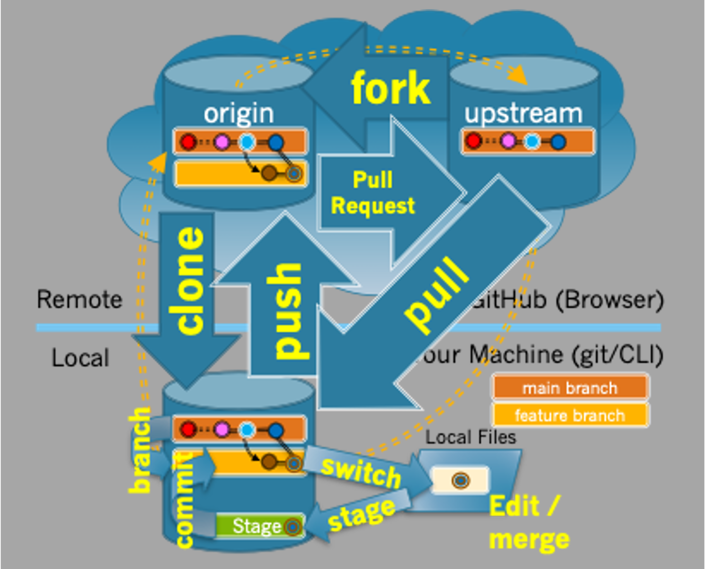

# Git Command Reference

## The Workflow

The figure below illustrates the actions that are a part of the commonly use forking/branching workflow associated with Git and GitHub.



A contributor using this workflow will typically use the following steps:
1. [Create a fork](#forking-a-repository) of the upstream repository into their own GitHub space.
2. [Clone their fork](#cloning-a-repository) to create their local copy of the repository.
3. [Create a new branch](#creating-a-new-branch) to work on a bug or feature.
4. [Switch to the new branch](#switching-between-branches) to make it active.
5. Make edits to fix the bug or implement the feature.
6. [Stage the changes](#staging-changes-for-a-commit) to be committed.
7. [Commit the changes](#committing-changes-to-the-active-branch) to the active branch.
8. [Push the changes](#pushing-changes-to-github) to their origin repository on GitHub.
9. [Create a Pull Request](#creating-a-pull-request) to the upstream for the branch.
10. [Synchronize with the upstream](#synchronizing-a-branch-with-the-upstream) when a branch has changed.

## Git Command Reference

The list below gives the commands that are used in each of the steps of the workflow.

### Forking a Repository
- When using the Codespaces based FD2 Development environment a fork will be created automatically for you as a part of the installation process.  Thus, you will not have to do this step manually.
- When working in other environments [a fork is made on GitHub](https://docs.github.com/en/pull-requests/collaborating-with-pull-requests/working-with-forks/fork-a-repo#forking-a-repository) by visiting the upstream repository for the project and clicking the "Fork" button.

### Cloning a Repository
```
git clone <origin-url>
```
- The `<origin-url>` is copied from the "Code" button of your origin repository on GitHub.

### Creating a new branch
```
git branch <branch-name>
```

### Switching between branches
```
git switch <branch-name>
```
    
#### Deleting a branch
```
git branch -D <branch-name>
git remote prune origin
```

### Staging Changes for a Commit
- Staging a file or files matching a pattern using `*`
  ```
  git stage <file>
  ```
- Staging all changed files
  ```
  git stage .
  ```
- Notes:
  - Commands stage files in the current working directory and its subdirectories.
  - `git add` is a synonym or `git stage`
  
  ### Committing Changes to the Active Branch
  ```
  git commit -m "<message>"
  ```
  - Commits the staged files to the currently active branch with the provided commit message.

### Pushing Changes to GitHub
```
git push origin <branch-name>
```

### Creating a Pull Request
- [A Pull Request is created on GitHub](https://docs.github.com/en/pull-requests/collaborating-with-pull-requests/proposing-changes-to-your-work-with-pull-requests/creating-a-pull-request-from-a-fork) by clicking the popup banner after pushing a branch, or by clicking the "Contribute" button.

### Synchronizing a Branch with the Upstream
  ```
  git switch <branch-name>
  git pull --ff-only upstream <branch-name>
  git push origin <branch-name>
  ```
  - Notes:
    - The same effect can be accomplished by switching to the branch to be synchronized in GitHub, clicking the "Synch fork" button, and then using the commands:
      ```
      git switch <branch-name>
      git pull origin <branch-name>
      ```

### Other Useful Commands

#### Displaying Information about Commits
```
git log
```
or
```
git log -<num>
```
- `<num>` indicates the number of commits to display (e.g. `-5`).

#### Undoing Recent Commits
  ```
  git reset --soft HEAD~<num>
  ```
  - Notes:
    - Removes the most recent `<num>` commits from the local clone (e.g. `HEAD~1` removes the most recent commit)
    - The changes that were in the commit will be staged after the `reset`.

#### Unstaging Staged Changes
- Unstaging a file or files matching a pattern using `*`
  ```
  git restore <file>
  ```
- Unstaging all staged files
  ```
  git restore .
  ```

#### Merging one Branch into another Branch
```
git switch <to-branch>
git merge <from-branch>
```
- The changes in `<from-branch>` will be added to `<to-branch>` if possible.
- If it is not possible, merge conflicts will be created that can be resolved manually, staged, and committed.

