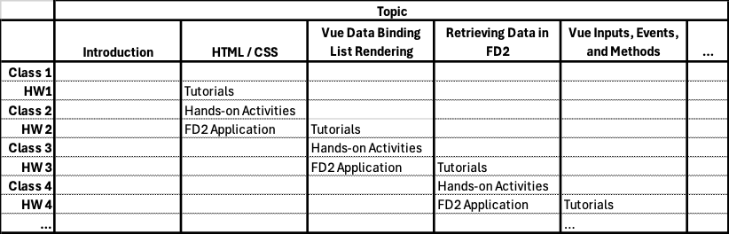

# FarmData2 School Instructor Guide

The FarmData2 (FD2) School materials are structured to be used in a course where students are familiar with git/gitHub, have worked in a linux environment, and have some prior programming experience. However, while FD2 is written primarily in HTML, CSS, JavaScript and Vue.js prior experience with those is not required.  The materials introduce enough of each technology that a student with prior programming experience can be successful.

The FD2 School activities move students through a series of introductory tutorials, hands-on activities, and homework applications. Each topic begins with students independently following an introductory tutorial outside of class that introduces them to a topic (e.g. HTML/CSS) and has them build a small artifact. Hands-on activities in the subsequent class has students expand their knowledge of the topic with several additional challenges that build upon the result of the tutorial. Finally, the a homework application following the class has them apply what they've learned to a feature in the FarmData2 project. The final result of completing the homework applications is that students will have added a basic Harvest feature to FarmData2.

The figure below illustrates visually how students progress through the introductory tutorials, hands-on activities and homework applications. Class 1 is an introductory class that introduces students to FarmData2 and the development environment and sets the stage for what they will be doing. In tutorial 1, student complete an HTML tutorial and a CSS tutorial that guide them through building a small static web page. Through hands-on activities in Class 2 they learning some new HTML elements and additional CSS Selectors and attributes and extend that web page. In homework application 2 they apply what they've learned about HTML and CSS to begin implementing the basic FarmData2 harvest feature. This pattern then repeats for [each of the topics](#topic-outline).

### Timing

- The hands-on activities for each class are nominally targeted to take 30-45 minutes. These activities have some initial activities and then some additional challenges. This is designed to ensure everyone has something to do for the allotted time and to allow the time to be adjusted based on other classroom needs.
- Each set of tutorials is nominally targeted to take between 1 and 2 hours outside of class.
- Each homework assignment is nominally targeted to take between 2 and 3 hours outside of class.

## Topic Outline

Below is the list of topics covered in FD2 School.  Below each topic is a list of the branches that exist in the FD2-School repository and when they should be merged into development.

1. 01-Introduction
2. 02-HTML/CSS
   - `02-HTML-CSS-Tutorials-Soln` (just before topic 02 class)
   - `02-HTML-CSS-Activity-Soln`  (just after topic 02 class)
   - `02-HTML-CSS-Application-Starter` (just after topic 02 class)
3. 03-Vue1: Vue Data Binding and List Rendering
   - `03-Vue1-Tutorials-Soln` (just before topic 03 class)
   - `03-Vue1-Activity-Soln` (just after topic 03 class)
   - `03-Vue1-Application-Starter` (just after topic 03 class)
     - This is the instructor solution to the 02-HTML-CSS-Application assignment.
4. 04-Vue2: Vue Inputs and User Events
   - `04-Vue2-Tutorials-Soln`
   - `04-Vue2-Activity-Soln`
   - `04-Vue1-Application-Starter`

?. Vue LifeCycle Hooks Promises / Retrieving Data in FarmData2
   - `0?-FD2-Data1-Tutorials-Soln` (just before topic 0? class)
   - `0?-FD2-Data1-Activity-Soln` (just after topic 0? class)
   - `0>-FD2-Data1-Application-Starter` (just after topic 0? class)
     - This is the instructor solution to the 03-Vue1-Application assignment.
5. Vue Inputs / Events / Methods
6. Vue Components / FarmData2 Components
7. Vue Conditional Rendering / Attribute Binding / Computed Properties
8. End-to-End Testing
9. Writing Data in FarmData2 / Unit Testing
10. FarmData2 Idioms & Practices

## Assignment Submission Logistics

- first exposure following tutorials is individual assignment.
  - submitted by PR by the student from the team's fork to the team's upstream.
- implementation of the feature in FD2 is a team assignment.
  - submitted by PR by someone on the team from the team's fork to the team's upstream.

## Instructor ToDo
- Form teams.
- Create an upstream FarmData2-School repo for the course
  - Fork the FarmData2-School-Base repo
  - This will be the upstream for the course
  - It will contain all starter/soln branches

## Process
- everyone creates their own fork of upstream repository
- For each assignment
  - Before assignment instructor merges starter code to upstream development
  - Students will 
    - Synchronize with upstream development to get the starter code
    - Create feature branch from development
    - Complete assignment and make PR to upstream development for their feature branch.
    - After due date instructor will merge branches for solution and starter code for next assignment into the upstream development branch.

- Feedback
  - use fetchPR to run student code
  - Do a PR review for feedback
  - Can have them respond to PR reviews for improved scores.

- All PRs get closed.

  

---

 All textual materials used in this repository are licensed under a [Creative Commons Attribution-NonCommercial-ShareAlike 4.0 International License](http://creativecommons.org/licenses/by-nc-sa/4.0/)

 All executable code in this repository is licensed under the [GNU General Public License Version 3 or later](https://www.gnu.org/licenses/gpl.txt)